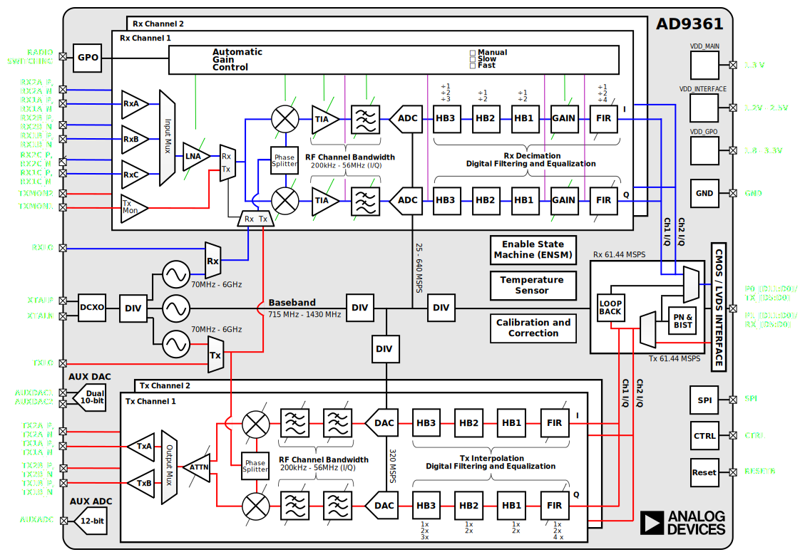

# Methods to synchronise NI B210s for MIMO operation

## Relevant sources
- [Synchronizing multiple AD9361 devices](https://wiki.analog.com/resources/eval/user-guides/ad-fmcomms5-ebz/multi-chip-sync?force_rev=1)
- [AD9361 Register Map Reference Manual](https://usermanual.wiki/Document/AD9361RegisterMapReferenceManualUG671.1082447504)
- [Schematic B210](https://files.ettus.com/schematics/b200/b210.pdf)
- [Ettus Research USRP FPGA HDL Source](https://github.com/EttusResearch/fpga)
- [AD community question related to phase diff](https://ez.analog.com/wide-band-rf-transceivers/design-support/f/q-a/543540/phase-difference-in-ad9361-multichip-synchronization)

## What needs to be synchronised for MIMO applications

At the RF transceiver:
- ADC/DAC sample clock
- RF mixer 
- Baseband digital clocks

At the FPGA:
- TBD

Between FPGA and host:
- USB (to be checked)

At the host:

## B210

Sync input:
- pulse per second input: PPS_IN_EXT (see schematic)
- 20MHz reference input (as no GPS option to our B210): REFIN (see schematic)

The REFIN is connected to the [ADF4001](https://www.analog.com/en/products/adf4001.html) (200MHZ Clock Generator PLL) which generates vcxo_tune which is connected to Voltage Controlled Temperature Compensated Crystal Oscillator (VCTCXO), which is than connected to a fan-out buffer to distribute it to xo_out (going to the AD9361) and xo_to_pll (to PLL RF in).

PPS_IN_EXT is connected to the Spartan6 IO_L34P_GCLK19_0.

PLL bring-up:
1. VCTCXO starts up
2. FX3 brings up transceiver, sets CLKOUT to FPGA
3. FX3 programs FPGA
4. FPGA writes to PLL, initializes PLL
5. PLL locks to external ref if avail.
6. If no ref, PLL tristated via SPI

## AD9361 - RF transceiver

The device utilizes a fractional-N synthesizer in the baseband PLL block to generate the desired sample rate for a given system. This synthesizer generates the ADC sample clock, DAC sample clock, and baseband digital clocks from any reference clock in the frequency range specified for the reference clock input.

### Clock input options (from AD9361 datasheet)
The AD9361 operates using a reference clock that can be provided
by two different sources. The first option is to use a dedicated
crystal with a frequency between 19 MHz and 50 MHz connected
between the XTALP and XTALN pins. The second option is to
connect an external oscillator or clock distribution device (such as
the AD9548) to the XTALN pin (with the XTALP pin remaining
unconnected). If an external oscillator is used, the frequency
can vary between 10 MHz and 80 MHz. This reference clock
is used to supply the synthesizer blocks that generate all data
clocks, sample clocks, and local oscillators inside the device.
Errors in the crystal frequency can be removed by using the
digitally programmable digitally controlled crystal oscillator
(DCXO) function to adjust the on-chip variable capacitor. This
capacitor can tune the crystal frequency variance out of the
system, resulting in a more accurate reference clock from which
all other frequency signals are generated. This function can also
be used with on-chip temperature sensing to provide oscillator
frequency temperature compensation during normal operation.

### RF PLLs (from AD9361 datasheet)
The AD9361 contains two identical synthesizers to generate the
required LO signals for the RF signal paths:—one for the receiver
and one for the transmitter. Phase-locked loop (PLL) synthesizers
are fractional-N designs incorporating completely integrated
voltage controlled oscillators (VCOs) and loop filters. In TDD
operation, the synthesizers turn on and off as appropriate for the
RX and TX frames. In FDD mode, the TX PLL and the RX PLL
can be activated simultaneously. These PLLs require no external
components

### BB PLL (from AD9361 datasheet)
The AD9361 also contains a baseband PLL synthesizer that is
used to generate all baseband related clock signals. These include
the ADC and DAC sampling clocks, the DATA_CLK signal (see
the Digital Data Interface section), and all data framing signals.
This PLL is programmed from 700 MHz to 1400 MHz based on
the data rate and sample rate requirements of the system. 

