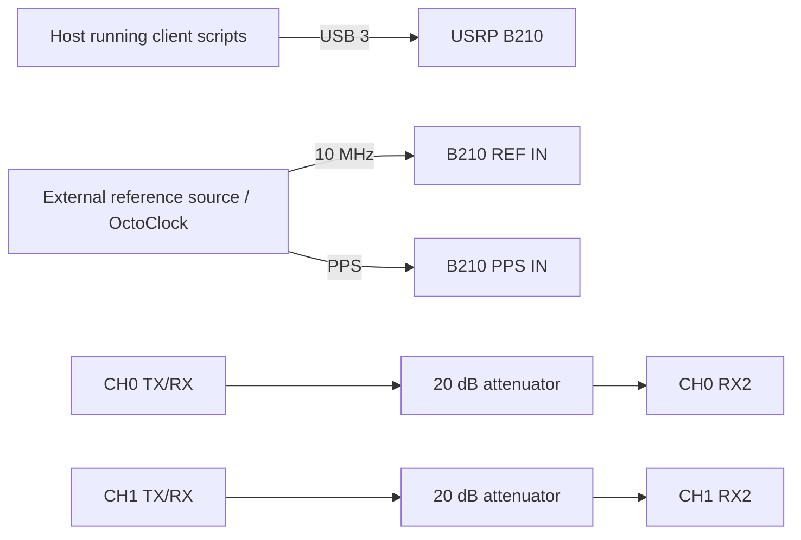

# Experiment 01 — single-B210 RX-gain sweep

This experiment measures the phase difference between the two receive chains while CH0 RX gain is fixed and CH1 RX gain is swept. The archived photograph and code show two same-channel external loopbacks on one B210.

## Connections

Use matched cables for the two RF paths, as shown in `setup-1.jpg`. Verify the attenuator power rating and begin at low TX gain; never connect a B210 TX directly to an RX input. The script uses 920 MHz, a 250 kS/s sample rate, fixed CH0 RX gain, and swept CH1 RX gain.

Run `client/run_experiment.sh` from the `client` directory. Raw IQ and metadata are processed by the scripts in `processing/`.
