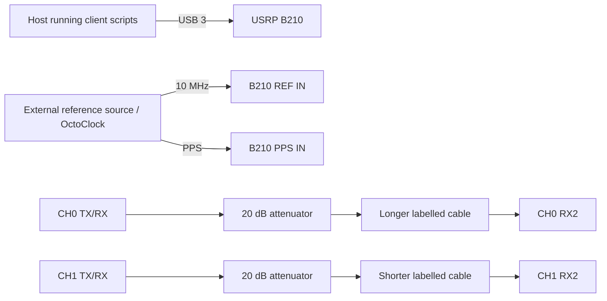

# Experiment 02 — RX-gain sweep with cable phase offset

This repeats Experiment 01 with deliberately unequal loopback cable lengths so that the two RX chains have a non-zero baseline phase difference. The setup photograph shows the longer path on CH0/A and the shorter path on CH1/B.

## Connections

Keep the two labelled paths in the same orientation for the complete sweep. Verify safe TX-to-RX attenuation before running `client/run_experiment.sh`. The script fixes CH0 RX gain and sweeps CH1 RX gain at 920 MHz.
