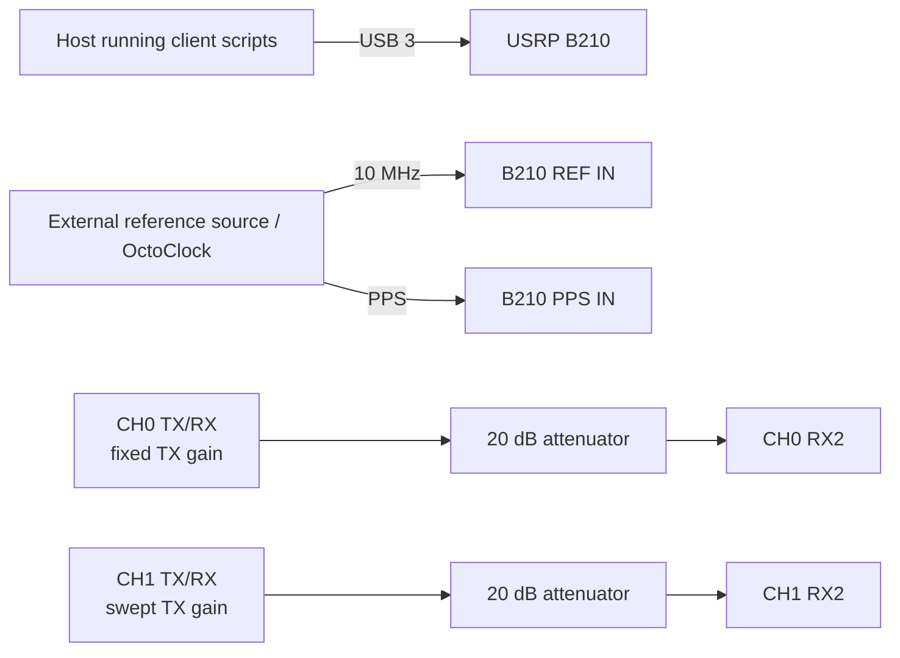

# Experiment 03 — single-B210 TX-gain sweep

This experiment uses the same two external loopback paths as Experiment 02, but fixes both RX gains and sweeps the CH1 TX gain while CH0 TX gain remains fixed.

## Connections

Do not remove either attenuator during the sweep. Check the maximum configured gain against the B210 RX input limit before starting `client/run_experiment.sh`.
