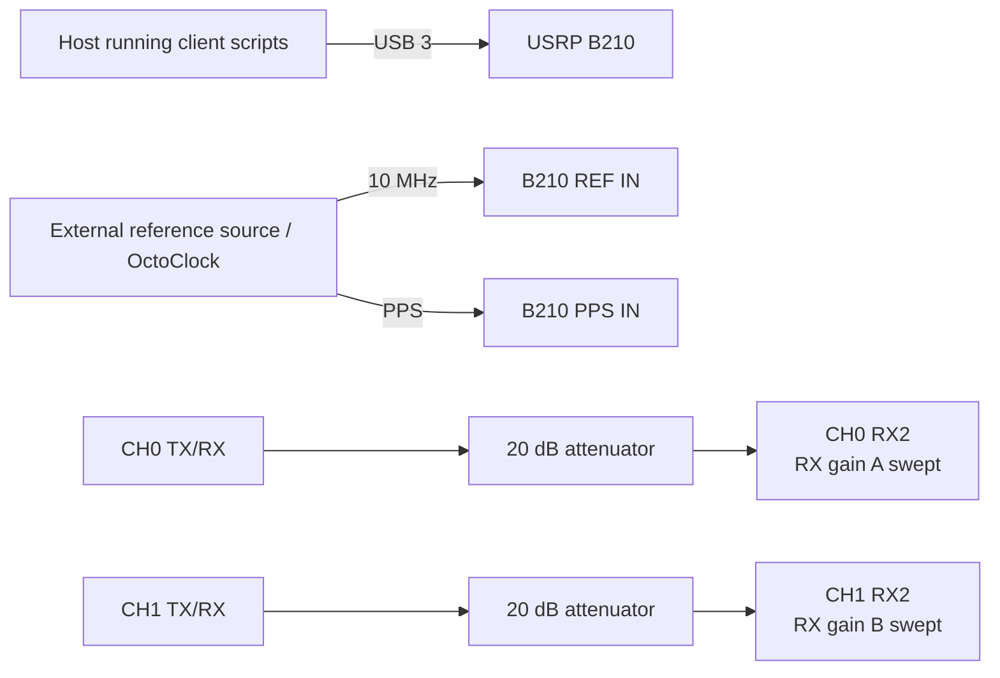

# Experiment 04 — two-dimensional RX-gain matrix

This experiment sweeps both receive gains and records the CH0-minus-CH1 phase over the complete gain matrix. Its RF topology is the same dual external loopback used by Experiments 01–03.

## Connections

Use fixed, labelled RF cables throughout the matrix; moving a cable changes the phase being attributed to gain. Run `client/run_experiment.sh`, then use the two- and three-dimensional plotting scripts in `processing/`.
