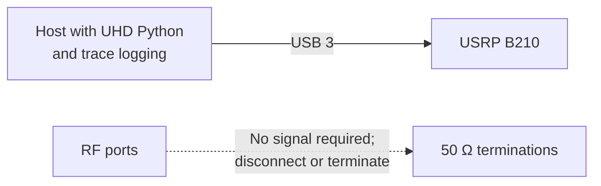

# Experiment 05 — B210 clock/VCO-rate trace sweep

This is a configuration-only experiment. It opens one B210, sweeps the master-clock rate, tunes the receiver to 917 MHz, and parses UHD trace output for BBPLL/VCO and divider settings. No RF stimulus is captured.

## Connections

The code does not select an external clock or PPS source, so none is required for reproducing the logged-rate sweep. Run `python3 sweep_rates.py`; it writes `uhd_debug_trace.log` and `clock_tuning_summary.csv` in this directory.
