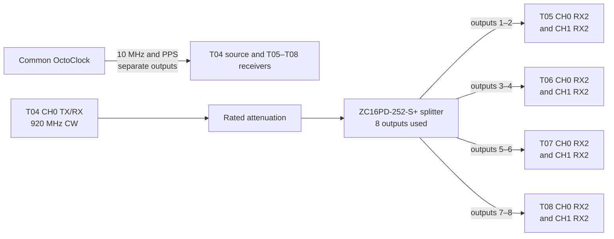

## 06_multi_usrp_rx

One testtile that transmit a sine wave
```
python3 examples/tx_waveforms.py  --args "type=b200" --freq 920e6 --rate 1e6 --duration 1e8 --channels 0 --wave-freq 0e5 --wave-ampl 0.8 --gain 70
```

### Connections



Measure the T04 power after attenuation and splitter loss before connecting any receiver. Keep each splitter output and cable assigned to the same RX port for the complete sweep.

<table>
  <tr>
    <td></td>
    <td></td>
    <td>
  
| ⚙️ Bash Settings   | Value | Unit |
|--------------|----------|-|
| GAIN_A       | 30       | dB |
| GAIN_B_START | 7        | dB |
| GAIN_B_STOP  | 48       | dB |
| GAIN_STEP    | 1        | dB |
| ITERATIONS [G]   | 2    | - |

</td><td>
  
| ⚙️ Python Settings | Value | Unit |
|--------------|----------|-|
| CLOCK_TIMEOUT  | 1000   | ms |
| INIT_DELAY     | 0.2    | s |
| RATE           | 250e3  | Hz |
| FREQ           | 920e6  | Hz |
| CAPTURE_TIME   | 2      | s |
| / | | |

</td></tr></table>

### Processing data

- **Create csv files** Mount the whole RPI folder structure via Samba to your PC to do the processing locally.
  Mount RPI folder en parse the location of the raw data, e.g.:
  - `W:\NI-B210-Sync\experiments\06_multi_usrp_rx\client\rawdata`
  - `X:\NI-B210-Sync\experiments\06_multi_usrp_rx\client\rawdata`
  - `V:\NI-B210-Sync\experiments\06_multi_usrp_rx\client\rawdata`
  - `U:\NI-B210-Sync\experiments\06_multi_usrp_rx\client\rawdata`

```
python experiments\06_multi_usrp_rx\processing\store_phase_difference.py --in-dir W:\NI-B210-Sync\experiments\06_multi_usrp_rx\client\rawdata --out-dir experiments\06_multi_usrp_rx\results
python experiments\06_multi_usrp_rx\processing\store_phase_difference.py --in-dir x:\NI-B210-Sync\experiments\06_multi_usrp_rx\client\rawdata --out-dir experiments\06_multi_usrp_rx\results
python experiments\06_multi_usrp_rx\processing\store_phase_difference.py --in-dir V:\NI-B210-Sync\experiments\06_multi_usrp_rx\client\rawdata --out-dir experiments\06_multi_usrp_rx\results
python experiments\06_multi_usrp_rx\processing\store_phase_difference.py --in-dir U:\NI-B210-Sync\experiments\06_multi_usrp_rx\client\rawdata --out-dir experiments\06_multi_usrp_rx\results
```

- **Create plots** plot_unit_circle
```
python .\experiments\06_multi_usrp_rx\processing\plot_unit_circle.py --csv_file .\experiments\06_multi_usrp_rx\results\T05_circmean_and_circstd.csv 
python .\experiments\06_multi_usrp_rx\processing\plot_unit_circle.py --csv_file .\experiments\06_multi_usrp_rx\results\T06_circmean_and_circstd.csv 
python .\experiments\06_multi_usrp_rx\processing\plot_unit_circle.py --csv_file .\experiments\06_multi_usrp_rx\results\T07_circmean_and_circstd.csv 
python .\experiments\06_multi_usrp_rx\processing\plot_unit_circle.py --csv_file .\experiments\06_multi_usrp_rx\results\T08_circmean_and_circstd.csv 
```

- **Create plots** plot_mean_2d
```
python .\experiments\06_multi_usrp_rx\processing\plot_mean_2d.py --csv_file .\experiments\06_multi_usrp_rx\results\T05_circmean_and_circstd.csv 
python .\experiments\06_multi_usrp_rx\processing\plot_mean_2d.py --csv_file .\experiments\06_multi_usrp_rx\results\T06_circmean_and_circstd.csv 
python .\experiments\06_multi_usrp_rx\processing\plot_mean_2d.py --csv_file .\experiments\06_multi_usrp_rx\results\T07_circmean_and_circstd.csv 
python .\experiments\06_multi_usrp_rx\processing\plot_mean_2d.py --csv_file .\experiments\06_multi_usrp_rx\results\T08_circmean_and_circstd.csv 
```

- **Create plots** plot_mean_std_angles
```
python .\experiments\06_multi_usrp_rx\processing\plot_mean_std_angles.py --csv_file .\experiments\06_multi_usrp_rx\results\circmean_and_circstd.csv
```

### Results [J] (plot_unit_circle)

<table>
  <tr>
    <td></td>
    <td></td>
  </tr>
  <tr>
    <td></td>
    <td></td>
  </tr>
</table>

### Results [J] (plot_mean_2d)

<table>
  <tr>
    <td></td>
    <td></td>
  </tr>
  <tr>
    <td></td>
    <td></td>
  </tr>
</table>

### Results [J] (plot_std_2d)

<table>
  <tr>
    <td></td>
    <td></td>
  </tr>
  <tr>
    <td></td>
    <td></td>
  </tr>
</table>

### Results [J] (phase_difference_vs_gainB_with_variance) [TX gain T04 was 70]


### Results [G] (phase_difference_vs_gainB_with_variance)


