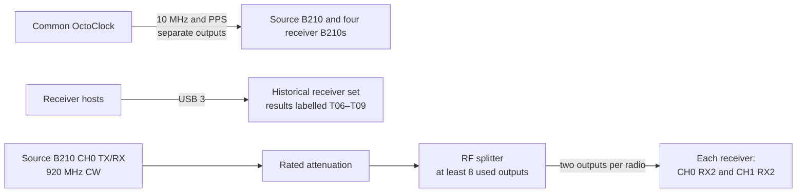

# Experiment 06 (archived setup) — multi-USRP RX-gain sweep

This archived predecessor feeds one common 920 MHz tone to both receive chains of four B210s and compares their gain-dependent CH0/CH1 phase. Result filenames identify the historical receiver set as T06–T09; confirm the physical labels before attempting to reproduce it.

## Connections

This directory lacks the later setup photographs and should be treated as archival. Keep all splitter outputs and cables fixed, verify source power at every RX input, and run `client/run_experiment.sh` separately on each receiver host.
