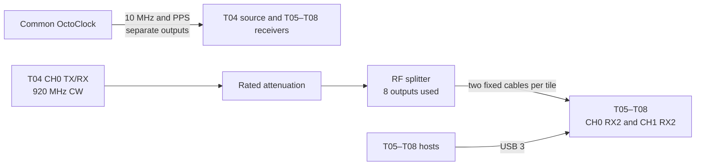

# Experiment 07 — multi-USRP phase stability over time

This experiment holds both RX gains at 38 dB and repeats four captures per hour for 100 hours. It reuses the common-tone, dual-RX topology of Experiment 06.

## Connections

Do not move the splitter or RF cables during the long run. Start the continuous T04 waveform described in the historical experiment notes, then run `client/run_experiment.sh` on every receiver. The shell script contains the hourly schedule.
