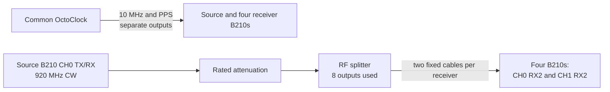

# Experiment 07 (archived setup) — multi-USRP phase stability over time

This is the archived predecessor of Experiment 07. The code performs the same fixed-gain, hourly dual-RX capture, but the surviving records do not identify the complete receiver-to-cable mapping.

## Connections

Treat this directory as archival and confirm every tile/cable label from the raw-data filenames before reuse. The maintained topology description is in `../07_multi_usrp_rx_time/README.md`.
