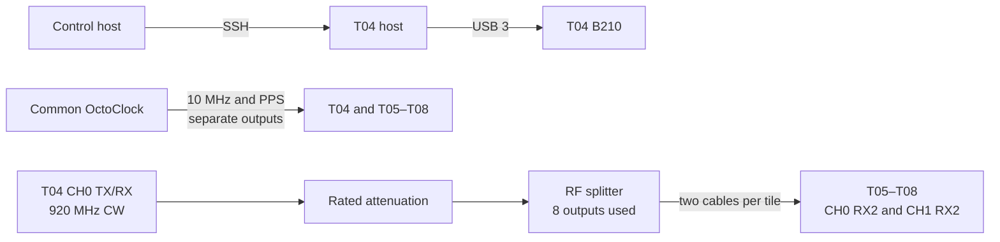

# Experiment 08 — source-power/SNR sweep

The intended experiment reuses the Experiment 06 splitter topology while sweeping the T04 transmit gain from 70 dB down to 50 dB. The current `run_experiment.sh` starts only the remote T04 waveform; its receiver-acquisition loops are commented out, so receiver captures must be started separately if this experiment is resumed.

## Connections

Measure the highest-gain power at the splitter outputs before connecting the receivers. Review the commented receiver loops and the hard-coded T04 address in `client/run_experiment.sh`; as stored, the script is not a complete synchronized acquisition.
