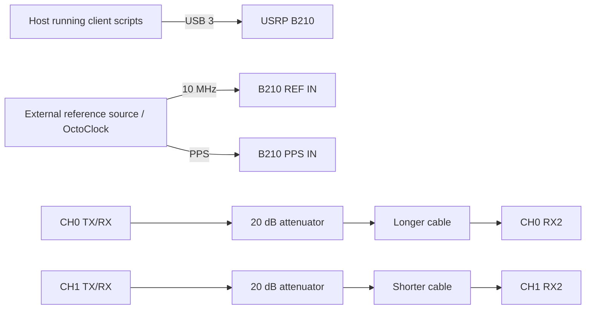

# Experiment 10 — duplicate single-B210 dual-RX sweep

The code is a near-duplicate of Experiment 01 and the surviving `setup-2.jpg` shows the unequal-cable topology used in Experiment 02. No separate historical objective is recorded, so treat this directory as an archived rerun rather than an independent setup.

## Connections

Confirm the intended cable assignment from `setup-2.jpg` before reuse. The stored shell script fixes CH0 RX gain and sweeps CH1 RX gain.
