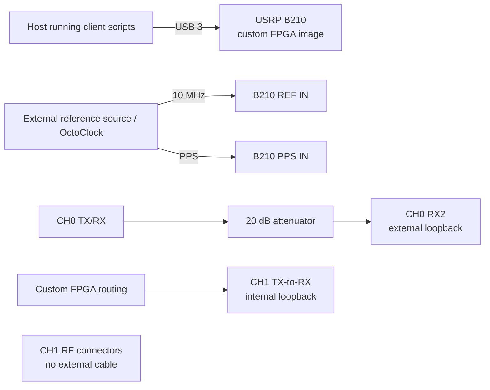

# Experiment 20 — external versus internal loopback on one B210

This experiment compares one externally cabled TX-to-RX path with the custom-FPGA internal loopback path on the other RF chain. The archived photograph shows the external loop on CH0/A and no external RF cable on CH1/B.

## Connections

Verify the custom image in `client/usrp_b210_fpga.bin` and the channel mapping on one radio before relying on the comparison. The physical attenuator must remain in the CH0 external loop. Run `client/run_experiment.sh` for ten fixed-gain repetitions.
