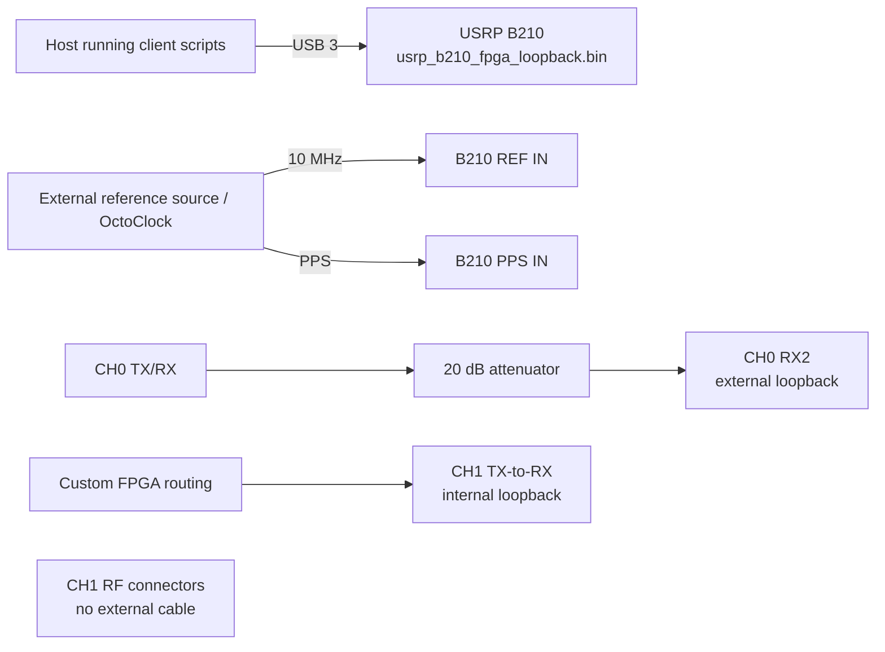

# Experiment 21 — revised custom-FPGA loopback on one B210

This repeats Experiment 20 using `usrp_b210_fpga_loopback.bin`. It compares the photographed CH0/A external loopback against the internally routed CH1/B path.

## Connections

Confirm the custom-image hash and verify both paths at low gain before collecting repetitions. Run `client/run_experiment.sh`; processing scripts compare the individual and relative phases.
