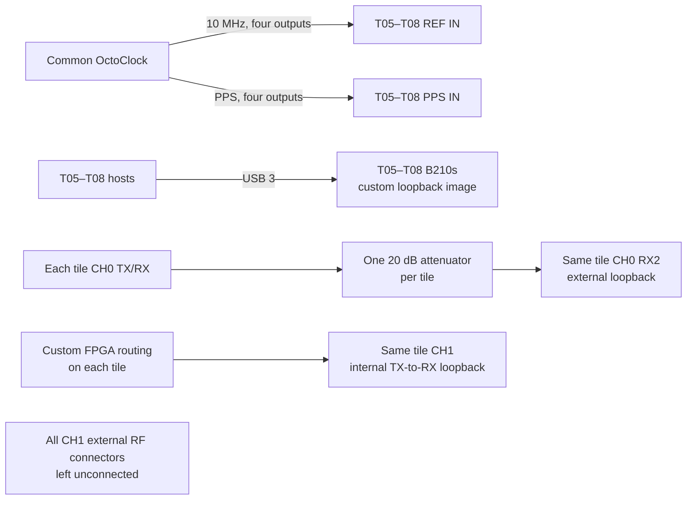

# Experiment 22 — external/internal loopback comparison on four B210s

This applies the Experiment 21 comparison to T05–T08. Every tile has one attenuated external loopback and one custom-FPGA internal loopback; the radios are not connected to one another at RF.

## Connections

Use four identical, labelled external-loop cables and verify attenuation separately on every tile. Run `client/run_experiment.sh` on each host; the stored script performs 50 fixed-gain repetitions.
