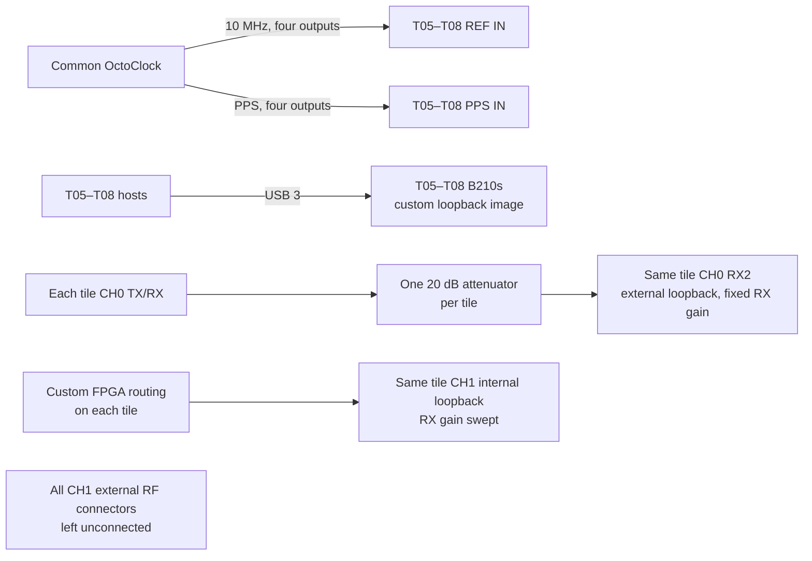

# Experiment 23 — four-B210 loopback RX-gain sweep

This uses the same four-radio external/internal comparison as Experiment 22 while sweeping CH1 RX gain. CH0 RX gain and both TX gains remain fixed.

## Connections

Keep the external-loop paths fixed during the sweep. Run `client/run_experiment.sh` on each participating tile; it sweeps CH1 RX gain from 7 to 48 dB.
