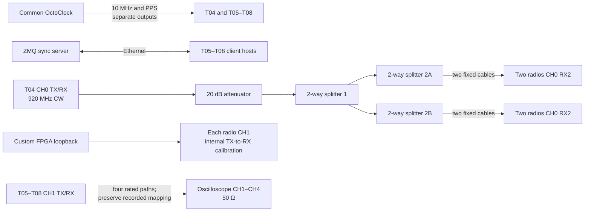

# 30_mulit_usrp_sync_only_lb

One testtile that transmit a sine wave
```
python3 examples/tx_waveforms.py  --args "type=b200" --freq 920e6 --rate 1e6 --duration 1e8 --channels 0 --wave-freq 0e5 --wave-ampl 0.8 --gain 70
```

- Four USRPs are synchronized using the reference signal applied to the RX port of channel 0.
- The RX/TX port of channel 1 is connected to the oscilloscope.
- A total of 100 iterations are performed.
- During each synchronization cycle, the oscilloscope measures the phase relationship of channels 2, 3, and 4 with respect to channel 1.

## Connections



The surviving files do not unambiguously record which tile was assigned to each scope channel. Preserve the historical cable labels when analyzing old data, and explicitly record the mapping before a rerun.

### Results [raw & abs(raw)]

<table>
  <tr>
    <td></td>
    <td></td>
  </tr>
</table>

### Results [between outputs same 2-way splitter & between outputs different 2-way splitters]

<table>
  <tr>
    <td></td>
    <td></td>
  </tr>
</table>

### Conclusion

That script to measure the phase differences is not good and requires an update.
