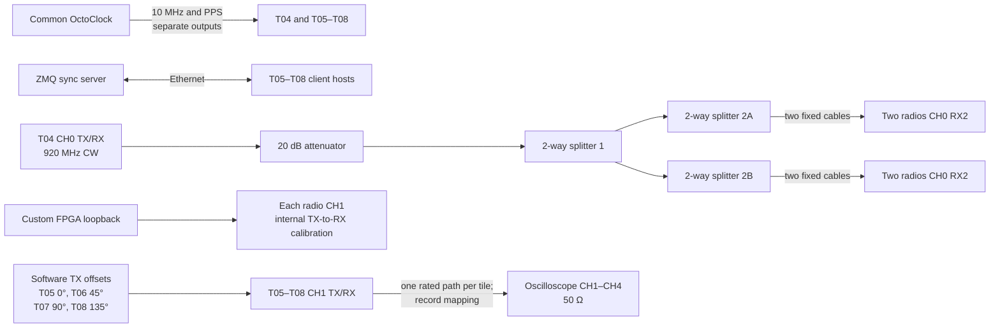

# 31_mulit_usrp_sync_only_lb_add_phase

- One testtile that transmit a sine wave
```
python3 examples/tx_waveforms.py  --args "type=b200" --freq 920e6 --rate 1e6 --duration 1e8 --channels 0 --wave-freq 0e5 --wave-ampl 0.8 --gain 70
```
- Four USRPs are synchronized using the reference signal applied to the RX port of channel 0.
- The RX/TX port of channel 1 is connected to the oscilloscope.
- A total of 100 iterations are performed.
- During each synchronization cycle, the oscilloscope measures the phase relationship of channels 2, 3, and 4 with respect to channel 1.
- The build-in measurement functie is used to measure the phases.
- To prevent incorrect phase results, additional **phase offsets** were added: T05: 0°, T06: 45°, T07: 90°, and T08: 135°.

## Connections



The phase offsets are software settings, not extra cable sections. Confirm and record the tile-to-scope-channel mapping before collecting data.


Before splitter 1 is a 20 dB attentuator

### Results [raw & phase offset removed]

<table>
  <tr>
    <td></td>
    <td></td>
  </tr>
</table>

| Channels     | Mean                 | Std                  |
|--------------|----------------------|-----------------------|
| CH1 - CH2    | 0.5744586887005192   | 0.9478001175555331    |
| CH1 - CH3    | 7.081923336931293    | 0.9869667338113204    |
| CH1 - CH4    | 7.959343748393683    | 0.9218934521364133    |

### Conclusion

- The update procedure (script) to measure phase relations with the scope is solved in this experiment.
- We can again observe that the outputs of the 2-way splitters exhibit a very good phase relationship. 
- As a result, the phase relationship between CH1–CH2 and CH3–CH4 yields very good results. 
- Consequently, CH1–CH3, CH1–CH4, CH2–CH3, and CH2–CH4 produce less accurate phase results.

⚠️ Here, the phase was always measured relative to CH1, in the following way:
CH1 − CH2, CH1 − CH3, CH1 − CH4.
