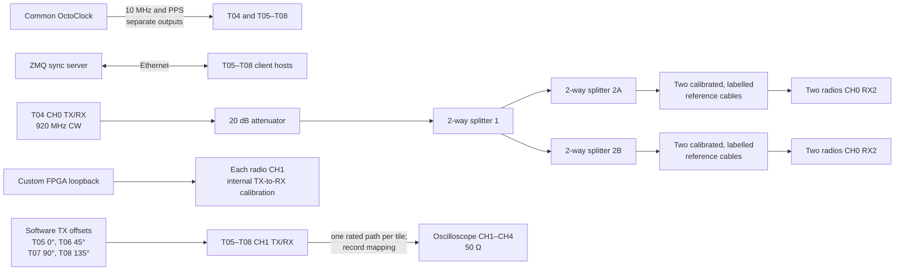

# 33_mulit_usrp_sync_only_lb_clo_add_phase

clo = cable length offset

- One testtile that transmit a sine wave
```
python3 examples/tx_waveforms.py  --args "type=b200" --freq 920e6 --rate 1e6 --duration 1e8 --channels 0 --wave-freq 0e5 --wave-ampl 0.8 --gain 70
```
- Four USRPs are synchronized using the reference signal applied to the RX port of channel 0.
- **HERE THERE ARE ADDITIONAL PHASE OFFSETS BETWEEN THE REFERENCE SIGNALS**
- The RX/TX port of channel 1 is connected to the oscilloscope.
- A total of 100 iterations are performed.
- During each synchronization cycle, the oscilloscope measures the phase relationship of channels 2, 3, and 4 with respect to channel 1.
- The build-in measurement functie is used to measure the phases.
- To prevent incorrect phase results, additional **phase offsets** were added: T05: 0°, T06: 45°, T07: 90°, and T08: 135°.


⚠️⚠️⚠️ To make this work, it is essential that the phase differences between the reference cables are measured with respect to one common reference, and then applied in the following way: CH2 − CH1, CH3 − CH1, CH4 − CH1. ⚠️⚠️⚠️

## Connections



Both calibration layers matter: keep the reference cables on their calibrated radios and apply the intentional phase offsets only in software. Record the tile-to-scope-channel mapping for each run.

### Results [raw & phase offset removed]


| Channels     | Mean                 | Std                   |
|--------------|----------------------|-----------------------|
| CH1 - CH2    |    |     |
| CH1 - CH3    |   |    |
| CH1 - CH4    |    |     |

### Conclusion

