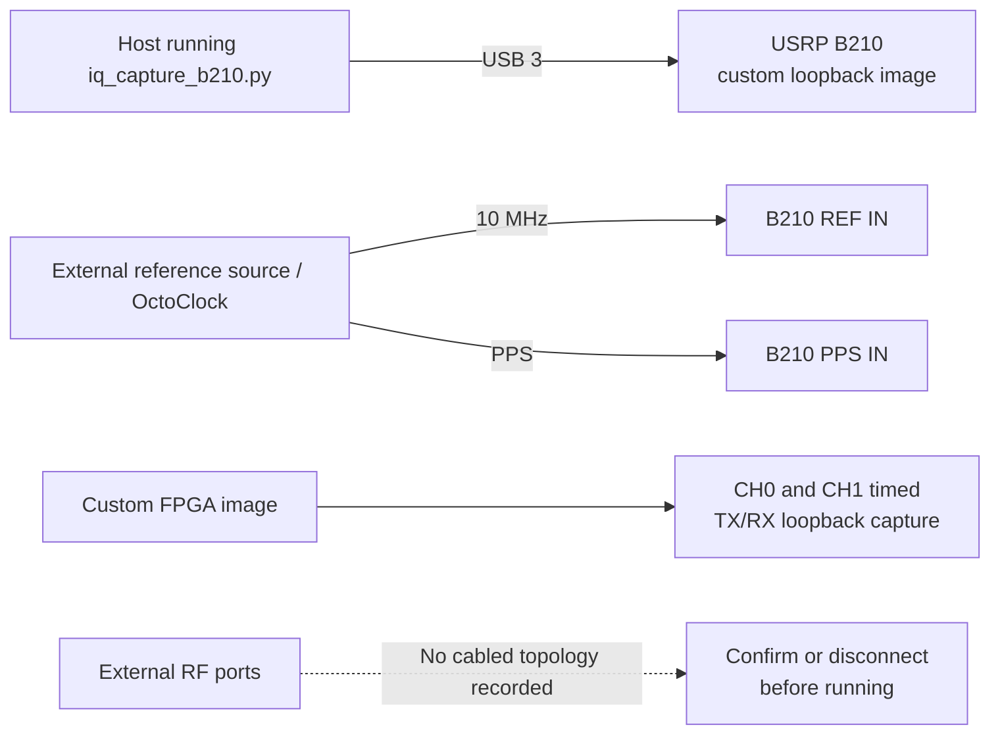

# Experiment 40 — local synchronization/loopback prototype

This directory is a prototype rather than a fully documented bench experiment. The code loads `usrp_b210_fpga_loopback.bin`, activates both TX and RX channels, requires external 10 MHz/PPS, and performs a timed local capture. No historical RF connection table survives.

## Inferred connections

The diagram is an inference from the code, not a verified reconstruction. The script requires command-line experiment, measurement, gain, and TX-gain arguments but has no wrapper script. Confirm what the custom FPGA image routes before enabling either transmitter.
