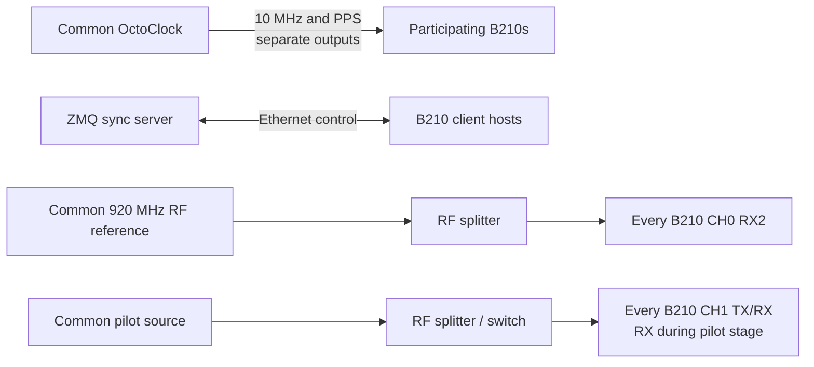
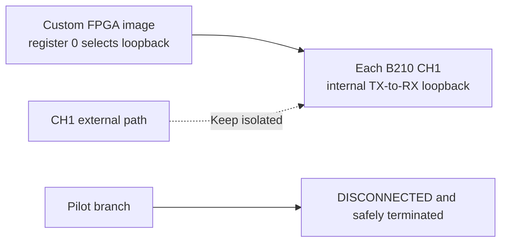
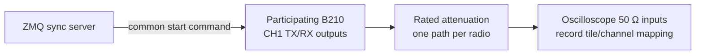

# Experiment 41 — synchronized pilot, loopback calibration, and transmission prototype

This prototype coordinates one or more B210 clients through the ZMQ server. With `RX_TX_SAME_CHANNEL: true`, CH0 receives the common RF reference, CH1 receives an external pilot, CH1 is then internally looped back, and CH1 finally transmits with the calculated phase correction. The surviving scope image shows a two-radio comparison, but the exact tile-to-scope-channel mapping is not recorded.

## Stage 1 — pilot acquisition

## Stage 2 — internal loopback

## Stage 3 — phase-corrected output comparison

These switching stages are inferred from the code and must not be hard-wired together without isolation: CH1 is reused for pilot reception and transmission. Confirm source protection, attenuation, and the intended participant count before running `server/sync-server.py` and the client wrapper.
