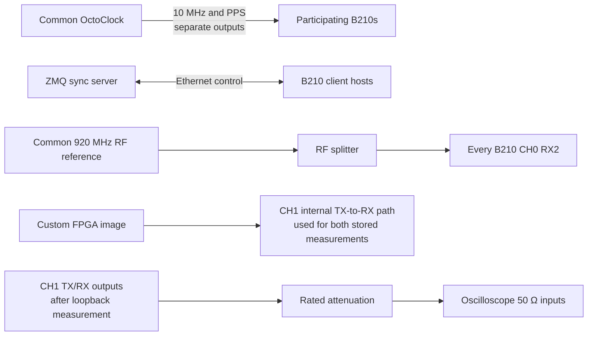

# Experiment 42 — internal-loopback synchronization prototype

Experiment 42 is a debugging variant of Experiment 41. In the stored code, both `measure_pilot` and `measure_loopback` enable the same custom-FPGA CH1 loopback path. It therefore does not acquire an independent external pilot and cannot by itself validate end-to-end pilot calibration.

## Inferred connections

Treat this directory as an incomplete prototype. Verify that the RF reference is safely applied to CH0, disconnect external CH1 inputs during internal loopback, and record the tile-to-scope mapping before any output comparison.
