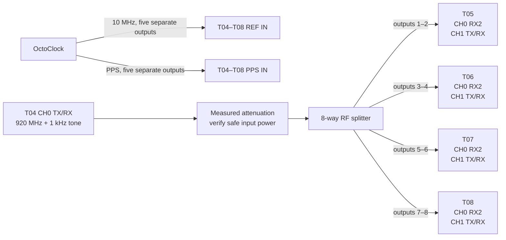
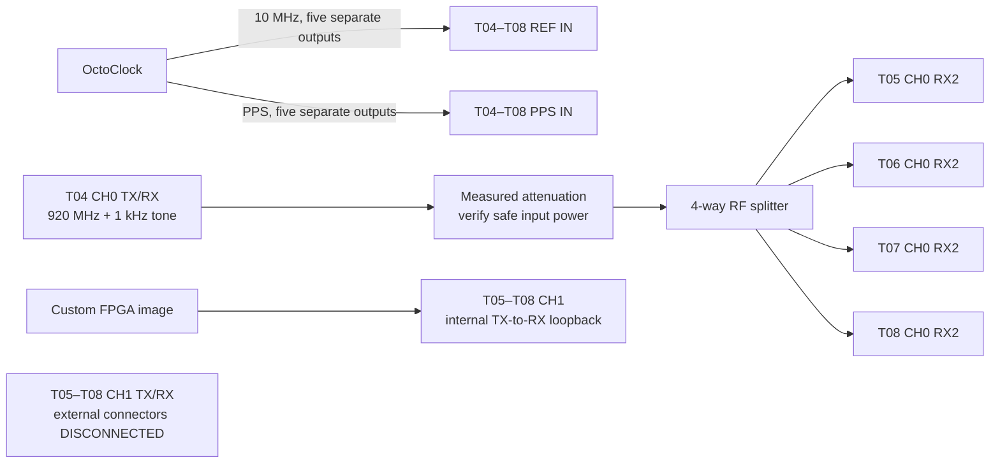

# Experiment 50 — B210 state and event repeatability (T05–T08)

This experiment implements the manuscript's missing B210 component characterization. It measures phase repeatability at a fixed configuration and the phase jump caused by a stream restart, device reopen, LO retune, RX/TX gain change, RF-port change, cold start, or reference interruption. Run it once in `external_pair` mode for the receive paths and once in `internal_loopback` mode for the RX–TX calibration path.

## Safety and prerequisites

- T04, T05, T06, T07, and T08 must receive the same external 10 MHz and PPS signals.
- Use 50 Ω RF components. Never connect a B210 TX directly to an RX or instrument input without checking the power and adding attenuation.
- Disable AGC and do not change frequency, rate, bandwidth, gain, or antenna port outside the scripted event.
- `internal_loopback` requires the custom FPGA image named in `config.yml` and the UHD version that exposes the user-settings register.

## T04 RF source

Use T04 CH0 `TX/RX` as the common RF source. T04 transmits a 1 kHz complex tone while tuned to 920 MHz, so the RF output is **920.001 MHz**. Use T04's installed/default FPGA image and leave the source process running, without reopening or retuning it, for the complete measurement pass.

After installing and measuring the complete distribution path, enter its output attenuation in `rf_source_output_attenuation_db`. Then start the source on T04, for example:

```bash
python3 experiments/t05_t08_common/run_t04_source.py \
  --config experiments/50_t05_t08_state_characterization/config.yml \
  --tx-gain-db 0
```

The 0 dB value is only a conservative initial bench setting, not a calibrated operating value. Measure the level at every receiver connector and choose the gain and attenuation from the power budget. The launcher refuses a hardware run while the attenuation remains unset.

## Connection A — `external_pair` RX characterization

Split T04's **920.001 MHz** output eight ways. Keep the same cables on the same ports for the complete run.

This mode uses the installed/default B210 FPGA image; the loopback image is loaded only in `internal_loopback` mode.

| From | To |
|---|---|
| OctoClock 10 MHz outputs | T04–T08 `REF IN` |
| OctoClock PPS outputs | T04–T08 `PPS IN` |
| T04 CH0 `TX/RX` through measured attenuation and an 8-way splitter, outputs 1–2 | T05 CH0 `RX2`, T05 CH1 `TX/RX` |
| Splitter outputs 3–4 | T06 CH0 `RX2`, T06 CH1 `TX/RX` |
| Splitter outputs 5–6 | T07 CH0 `RX2`, T07 CH1 `TX/RX` |
| Splitter outputs 7–8 | T08 CH0 `RX2`, T08 CH1 `TX/RX` |



For a separate CH0/CH1 or `RX2`/`TX/RX` pass, physically swap the paths and update `reference_channel`, `measured_channel`, and antenna names. Do not interpret `rx_port_change` unless both selected ports are fed safely by the source.

## Connection B — `internal_loopback` RX–TX characterization

| From | To |
|---|---|
| OctoClock 10 MHz and PPS | T04–T08 reference inputs, as above |
| T04 CH0 `TX/RX` through measured attenuation and a 4-way splitter | CH0 `RX2` on T05, T06, T07, and T08 |
| CH1 `TX/RX` | Leave disconnected from external equipment; the custom FPGA loopback is selected by the script |



Confirm on one radio at low gain that enabling the custom loopback does not radiate unsafe power before running all four.

To characterize the other TX/RX chain, swap `reference_channel` and `measured_channel`, move the common reference to the configured reference input, and repeat the complete pass. Never change only the YAML channel numbers without changing and rechecking the physical connections.

## Run

Copy the repository to every Raspberry Pi. On each node, activate the UHD Python environment and run, for example:

```bash
python3 experiments/50_t05_t08_state_characterization/run_node.py \
  --tile T05 --mode external_pair --repeats 100
```

First inspect the plan without opening hardware:

```bash
python3 experiments/50_t05_t08_state_characterization/run_node.py \
  --tile T05 --mode external_pair --repeats 100 --dry-run
```

Run manual interventions only with an operator present:

```bash
python3 experiments/50_t05_t08_state_characterization/run_node.py \
  --tile T05 --event cold_start --event reference_interruption \
  --allow-manual-events
```

The process exits non-zero if a late timestamp, RX overflow/timeout, TX error, or missing lock invalidates any observation. Those failures remain in JSONL rather than being mixed into phase statistics.

## Analyze

Bring the four JSONL files to one machine and run:

```bash
python3 experiments/50_t05_t08_state_characterization/analyze.py \
  experiments/50_t05_t08_state_characterization/runs/*.jsonl \
  --output state_summary.csv
```

The key result is `jump_from_before_deg`; its sign is **after minus before**, wrapped to ±180°. Record T04's serial number, TX gain, tone amplitude, measured output attenuation, splitter/cable identifiers, UHD version, FPGA hash, and all B210 serial numbers alongside the run.
