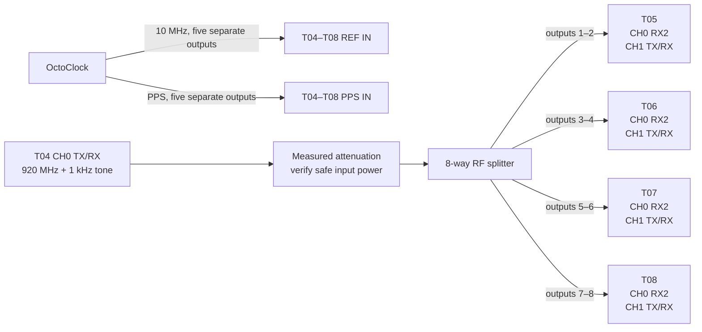
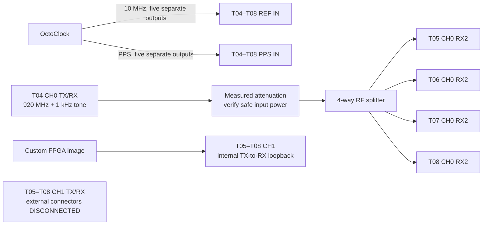

# Experiment 50 — B210 state and event repeatability (T05–T08)

This experiment implements the manuscript's missing B210 component characterization. It measures phase repeatability at a fixed configuration and the phase jump caused by a stream restart, device reopen, LO retune, RX/TX gain change, RF-port change, cold start, or reference interruption. Run it once in `external_pair` mode for the receive paths and once in `internal_loopback` mode for the RX–TX calibration path.

`client/` runs on T05–T08, `server/` runs the T04 source and the coordinated scheduler, and `processing/` runs offline analysis. The experiment root retains the shared `config.yml`, this connection guide, and ignored `runs/` output.

## Safety and prerequisites

- T04, T05, T06, T07, and T08 must receive the same external 10 MHz and PPS signals.
- Use 50 Ω RF components. Never connect a B210 TX directly to an RX or instrument input without checking the power and adding attenuation.
- Disable AGC and do not change frequency, rate, bandwidth, gain, or antenna port outside the scripted event.
- `internal_loopback` requires the custom FPGA image named in `config.yml` and the UHD version that exposes the user-settings register.

## T04 RF source

Use T04 CH0 `TX/RX` as the common RF source. T04 transmits a 1 kHz complex tone while tuned to 920 MHz, so the RF output is **920.001 MHz**. Use T04's installed/default FPGA image and leave the source process running, without reopening or retuning it, for the complete measurement pass.

After installing and measuring the complete distribution path, enter its output attenuation in `rf_source_output_attenuation_db`. Then start the source on T04, for example:

```bash
python3 experiments/50_t05_t08_state_characterization/server/run_t04_source.py \
  --tx-gain-db 0
```

The 0 dB value is only a conservative initial bench setting, not a calibrated operating value. Measure the level at every receiver connector and choose the gain and attenuation from the power budget. The launcher refuses a hardware run while the attenuation remains unset.

## Connection A — `external_pair` RX characterization

Split T04's **920.001 MHz** output eight ways. Keep the same cables on the same ports for the complete run.

This mode uses the installed/default B210 FPGA image; the loopback image is loaded only in `internal_loopback` mode.

| From | To |
|---|---|
| OctoClock 10 MHz outputs | T04–T08 `REF IN` |
| OctoClock PPS outputs | T04–T08 `PPS IN` |
| T04 CH0 `TX/RX` through measured attenuation and an 8-way splitter, outputs 1–2 | T05 CH0 `RX2`, T05 CH1 `TX/RX` |
| Splitter outputs 3–4 | T06 CH0 `RX2`, T06 CH1 `TX/RX` |
| Splitter outputs 5–6 | T07 CH0 `RX2`, T07 CH1 `TX/RX` |
| Splitter outputs 7–8 | T08 CH0 `RX2`, T08 CH1 `TX/RX` |



For a separate CH0/CH1 or `RX2`/`TX/RX` pass, physically swap the paths and update `reference_channel`, `measured_channel`, and antenna names. Do not interpret `rx_port_change` unless both selected ports are fed safely by the source.

## Connection B — `internal_loopback` RX–TX characterization

| From | To |
|---|---|
| OctoClock 10 MHz and PPS | T04–T08 reference inputs, as above |
| T04 CH0 `TX/RX` through measured attenuation and a 4-way splitter | CH0 `RX2` on T05, T06, T07, and T08 |
| CH1 `TX/RX` | Leave disconnected from external equipment; the custom FPGA loopback is selected by the script |



Confirm on one radio at low gain that enabling the custom loopback does not radiate unsafe power before running all four.

To characterize the other TX/RX chain, swap `reference_channel` and `measured_channel`, move the common reference to the configured reference input, and repeat the complete pass. Never change only the YAML channel numbers without changing and rechecking the physical connections.

## Run

### Coordinated T05–T08 run

Use this path for results that compare event timing or phase jumps across tiles. It does not rely on RPi process-start time. The scheduler sends every B210 the same future device-time capture command, checks every returned `first_sample_time_s`, and rejects a group whose capture timestamps differ from the requested time or from each other by more than `capture_alignment_tolerance_s` (one 250 kS/s sample by default).

1. Start the T04 source as above. On the coordinating computer, start the server for the wired connection pass:

   ```bash
   python3 experiments/50_t05_t08_state_characterization/server/coordinator.py \
     --mode external_pair --repeats 100
   ```

2. On each tile, start one client. Replace `<coordinator-ip>` with the address of the computer running the coordinator:

   ```bash
   python3 experiments/50_t05_t08_state_characterization/client/run_node.py \
     --tile T05 --mode external_pair --coordinator <coordinator-ip>
   ```

The server waits for T05–T08 and writes one combined JSONL file. The default coordinated set includes `fixed_repeat`, `stream_restart`, `lo_retune`, `rx_gain_change`, and `rx_port_change` for `external_pair`; `tx_gain_change` replaces `rx_port_change` for `internal_loopback`.

`lo_retune`, gain changes, and RF-port changes are queued on each B210 with the same UHD command time. `stream_restart` is represented by the common start time of the next timed RX stream. Reopen, cold-start, and reference-interruption trials are deliberately excluded from the coordinated set: RPi shutdown/reopen and operator actions have nondeterministic completion times, so labelling them as simultaneous would be false.

The control connection is newline-delimited JSON over TCP, reusing the repository's client/server protocol. ZeroMQ can be substituted as the transport later, but it cannot provide synchronization on its own; the shared PPS epoch, common future B210 timestamp, and first-sample validation are the timing mechanism.

This verifies timed digital capture scheduling, not the analog PPS-distribution skew or RF cable delay. Keep the separately measured OctoClock/PPS skew and fixed cable phases in the experiment's phase-error budget.

### Per-tile/manual run

Use the standalone client only for a single-tile characterization or the explicitly unscheduled `device_reopen`, `cold_start`, and `reference_interruption` trials. It does not provide a cross-tile timing claim. Copy the repository to every Raspberry Pi, activate the UHD Python environment, and run, for example:

```bash
python3 experiments/50_t05_t08_state_characterization/client/run_node.py \
  --tile T05 --mode external_pair --repeats 100
```

First inspect the coordinated plan without opening hardware:

```bash
python3 experiments/50_t05_t08_state_characterization/server/coordinator.py \
  --mode external_pair --repeats 100 --dry-run
```

Or inspect an individual standalone-node plan:

```bash
python3 experiments/50_t05_t08_state_characterization/client/run_node.py \
  --tile T05 --mode external_pair --repeats 100 --dry-run
```

Run manual interventions only with an operator present:

```bash
python3 experiments/50_t05_t08_state_characterization/client/run_node.py \
  --tile T05 --event cold_start --event reference_interruption \
  --allow-manual-events
```

The process exits non-zero if a late timestamp, RX overflow/timeout, TX error, or missing lock invalidates any observation. Those failures remain in JSONL rather than being mixed into phase statistics.

## Analyze

Bring the four JSONL files to one machine and run:

```bash
python3 experiments/50_t05_t08_state_characterization/processing/analyze.py \
  experiments/50_t05_t08_state_characterization/runs/*.jsonl \
  --output state_summary.csv \
  --figure-dir state_figures
```

The command writes `state_summary.csv` and three Matplotlib PNG figures. Use `--no-figures` for CSV-only processing on a system without Matplotlib.

No completed Experiment 50 hardware run is committed yet, so this README does not claim numerical results. The fields and plots below state exactly what will be measured and how those values answer the experiment questions.

### Measured and derived values

Each successful JSONL observation contains the following capture-level values:

| Value | Meaning |
|---|---|
| `phase.phase_deg` | Simultaneous reference-minus-measured phase, wrapped to ±180°. In `external_pair` this compares the two externally driven RX paths; in `internal_loopback` it compares the external reference with the RX–TX loopback path. |
| `phase.circular_std_deg` | Phase spread between correlation blocks inside one capture. This measures short-term stability during that capture. |
| `phase.amplitude` | Fitted reference-path correlation amplitude in normalized I/Q units. It is useful for consistency checks, but is not calibrated RF voltage or power. |
| `phase.residual_rms` | RMS difference between the observed samples and the fitted correlated waveform. Large values flag noise, distortion, clipping, or a poor fit. |
| `phase.sample_count` / `phase.block_count` | Samples and complete correlation blocks used by the estimator. |
| `scheduled_start_time_s`, `first_sample_time_s` | Requested common B210 time and the first accepted sample time. The coordinated server rejects a mismatch. |
| `event_time_s` | Common scheduled UHD time of a retune/gain/port intervention, or the common post-restart capture time for `stream_restart`. |
| `capture_alignment_error_s`, `capture_alignment_spread_s` | Per-tile error from the requested time and spread across all four first-sample timestamps. These must be within `capture_alignment_tolerance_s` before comparing a cross-tile jump. |
| `overflow_count` / `timeout_count` | Streaming faults. A valid capture should report zero; failed observations are counted separately rather than included in phase statistics. |

`state_summary.csv` aggregates those observations for each tile, mode, event, and stage:

| Output column | Interpretation |
|---|---|
| `successful_runs`, `failed_runs`, `success_fraction` | Acquisition reliability and the number of observations contributing to the statistics. |
| `circular_mean_deg` | Mean absolute phase state for that group. Because cables contribute an arbitrary constant phase, comparisons are normally more useful than this value alone. |
| `circular_std_deg` | Run-to-run repeatability of the phase state. A small value means repeated captures converge to the same state. |
| `jump_from_before_deg` | Circular mean of the paired per-file **after minus before** event jumps, wrapped to ±180°. This is the principal event-invalidation result. It is unavailable for `fixed_repeat`, which deliberately has no `before` stage. |
| `jump_circular_std_deg`, `paired_event_runs` | Repeatability of the event jump and the number of complete before/after run pairs used. A consistent nonzero jump differs from an unpredictable reset. |
| `within_capture_circular_std_mean_deg`, `within_capture_circular_std_max_deg` | Typical and worst short-term block-to-block phase spread inside a capture. |
| `amplitude_mean`, `amplitude_std` | Mean and run-to-run variation of the fitted correlation amplitude. |
| `residual_rms_mean`, `residual_rms_std` | Mean and run-to-run variation of the correlation residual. |
| `correlation_quality_mean_db` | (20\log_{10}(\text{amplitude}/\text{residual RMS})). This is a fit-quality indicator, not a calibrated SNR measurement. |
| `sample_count_mean`, `block_count_mean` | Check that compared groups were estimated from equivalent data lengths. |
| `capture_alignment_error_max_s`, `capture_alignment_spread_max_s` | Worst accepted timing error from the requested common device time and worst observed four-tile first-sample spread. They are `NaN` for a standalone per-tile run. |

### Questions answered

| Question | Events/modes and deciding values |
|---|---|
| Is phase stable when the configuration is untouched? | `fixed_repeat` in both modes; inspect `circular_std_deg`, the within-capture spread, and `phase_observations.png`. |
| Does restarting only the UHD stream invalidate phase calibration? | `stream_restart`; inspect `jump_from_before_deg` and its spread. |
| Does reopening the B210 select a new phase state? | Per-tile `device_reopen` trial; compare the paired jump, jump spread, and raw phase clusters. It does not make a cross-tile simultaneity claim. |
| Does an LO retune change the RF phase state even when returning to the original frequency? | `lo_retune`; inspect its paired jump in both modes. |
| Do RX gain or RX port changes introduce analog phase offsets? | `rx_gain_change` and `rx_port_change` in `external_pair`; compare their event jumps with fixed-repeat spread. |
| Does a TX gain change alter the transmit calibration path? | `tx_gain_change` in `internal_loopback`; inspect the paired jump and correlation amplitude for evidence of clipping or a poor fit. |
| Do a cold start or reference interruption require recalibration? | Manual `cold_start` and `reference_interruption` trials; a repeatable or stochastic nonzero jump means the prior phase coefficient cannot be reused. |
| Is an observed phase change physical or a low-quality measurement? | Check `correlation_quality_mean_db`, amplitude, residual RMS, failures, and sample/block counts before interpreting any jump. |
| Which part of the chain is affected? | Compare `external_pair` with `internal_loopback`. A change confined to loopback implicates the TX/loopback path; a change in both modes may include the reference/RX path. |

Judge a jump against the phase-error budget of the intended coherent array; the analyzer deliberately does not impose an arbitrary pass/fail threshold.

### Matplotlib figures

The analyzer creates:

- `phase_observations.png` — every successful wrapped phase observation, separated by mode, event, stage, and tile; use it to find outliers or multiple phase states hidden by a mean;
- `event_phase_jumps.png` — paired after-minus-before phase jumps with circular-spread error bars; use it to identify calibration-invalidating events; and
- `repeatability_and_quality.png` — between-run circular spread beside correlation-quality measurements; use it to distinguish unstable hardware state from weak or distorted measurements.

Record T04's serial number, TX gain, tone amplitude, measured output attenuation, splitter/cable identifiers, UHD version, FPGA hash, and all B210 serial numbers alongside the run.
