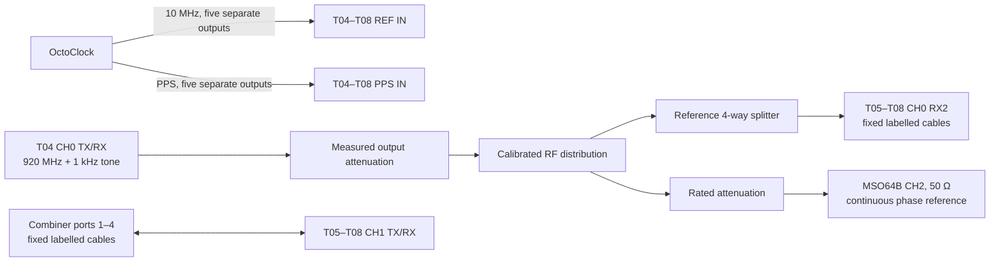
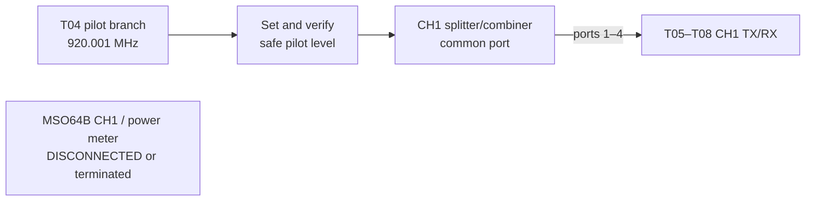
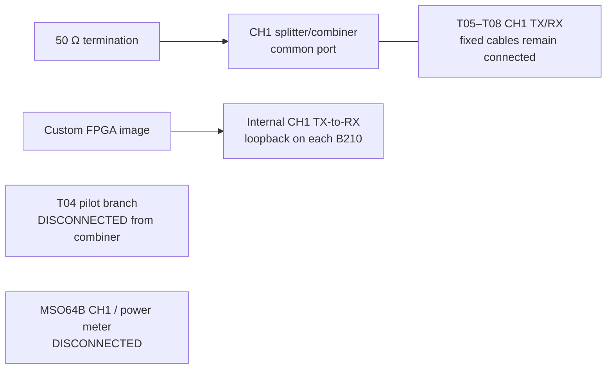
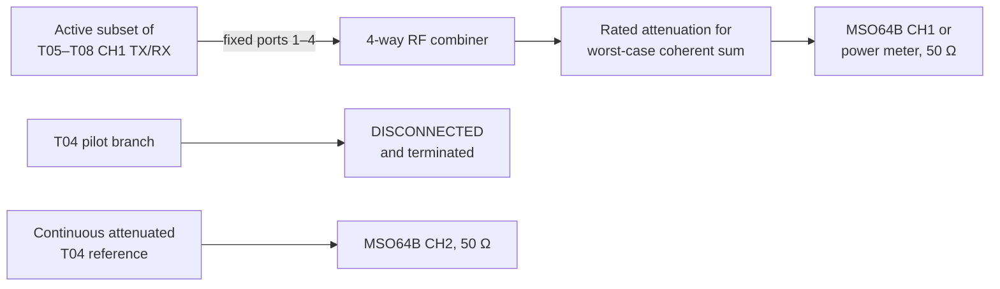

# Experiment 51 — controlled coherent combining (T05–T08)

This is the four-radio controlled end-to-end experiment requested by the manuscript. It measures residual calibration phase per radio and received power for one through four active transmitters. Each count is repeated with calibrated phases, zero baseband phase, and deterministic random phases. The result is compared with ideal coherent \(M^2\) and incoherent \(M\) power scaling.

## Required equipment

- T04 with its installed/default FPGA image, used only as the RF source;
- T05, T06, T07, and T08 with the custom loopback FPGA image;
- one OctoClock (common 10 MHz and PPS for T04–T08);
- calibrated RF distribution that provides the CH0 reference, CH1 pilot, and an attenuated scope phase reference;
- one reciprocal 4-way RF splitter/combiner for the CH1 paths;
- a rated 20 dB attenuator (or attenuation calculated for the worst-case four-TX sum);
- a 50 Ω MSO64B input or RF power meter; and
- four fixed, labelled CH1 cables and four fixed, labelled reference cables.

Check every component's frequency and power rating. Four coherent equal-power signals can produce four times the voltage and sixteen times the single-radio power at the combiner output. Start with low TX gain and more attenuation than the calculated minimum.

Before the run, configure both scope channels with the same sufficiently high sample rate and a time span containing many 920.001 MHz cycles. Set each vertical scale to avoid clipping. The script reads the actual sample interval and rejects a rate below its RF-correlation limit; it does not choose the instrument's horizontal or vertical scale for you.

## T04 RF source

T04 CH0 `TX/RX` provides the reference, pilot, and attenuated scope-reference branches. It transmits a 1 kHz complex tone at a 920 MHz center frequency, producing **920.001 MHz** RF. Leave T04 running with the same tuning and reference lock from pilot acquisition through the last combining measurement.

After installing and measuring the complete distribution path, enter its output attenuation in `rf_source_output_attenuation_db`. Start the source on T04, for example:

```bash
python3 experiments/t05_t08_common/run_t04_source.py \
  --config experiments/51_t05_t08_coherent_combining/config.yml \
  --tx-gain-db 0
```

The 0 dB value is only a conservative initial bench setting. Verify the level at every B210 and scope input and select the operating gain and attenuation from the power budget. The launcher refuses a hardware run while the attenuation remains unset.

## Connections

The setup has a fixed part and one common-port connection that changes between calibration and downlink measurement.

| From | To |
|---|---|
| OctoClock 10 MHz outputs | `REF IN` on T04–T08 |
| OctoClock PPS outputs | `PPS IN` on T04–T08 |
| T04 CH0 `TX/RX` through measured attenuation | Calibrated RF distribution input |
| T04 reference branch through 4-way splitter | CH0 `RX2` on T05–T08 |
| 4-way splitter/combiner ports 1–4 | CH1 `TX/RX` on T05, T06, T07, T08 respectively |
| T04 scope-reference branch through rated attenuation | MSO64B CH2, 50 Ω |

The clock and RF-reference paths below remain connected throughout all three stages. The CH1 combiner's common-port connection is the part that changes.



Calibration position:

| From | To |
|---|---|
| T04 pilot branch | Common port of the CH1 4-way splitter/combiner |
| Scope/power meter | Disconnected or terminated |



After pilot acquisition, disconnect and terminate the T04 pilot branch before the script enables internal loopback. This prevents TX leakage from being driven back into T04. Keep T04's reference and scope-reference branches connected. Use a rated high-isolation transfer switch if the change is automated.

Internal-loopback position:



Downlink-power position:

| From | To |
|---|---|
| Common port of the CH1 combiner | Rated attenuation, then MSO64B/power-meter 50 Ω input |
| T04 pilot branch | Disconnected and terminated |



Move only the common-port cable at the prompt. Leave the attenuated scope-reference branch on CH2 for both individual residual-phase and combined-power measurements. Never move the four tile cables between pilot acquisition and power measurement. A transfer switch is preferable to manual reconnection.

## Reference-cable calibration

Measure each CH0 reference-cable phase relative to the T05 cable at 920.001 MHz. Enter the manuscript convention \(\varphi_{cable,i}\) in `reference_cable_phase_deg`, then set `reference_cable_phase_calibrated: true`. The coordinator refuses a normal run while placeholder values remain.

## Run order

1. Start the coordinator on the computer that can reach all four RPis and the scope:

   ```bash
   python3 experiments/51_t05_t08_coherent_combining/coordinator.py
   ```

2. On each RPi, start its node while the T04 pilot branch is connected. Example for T05:

   ```bash
   python3 experiments/51_t05_t08_coherent_combining/run_node.py \
     --tile T05 --coordinator 10.128.48.3
   ```

3. After pilot and loopback acquisition, follow the coordinator's common-port prompts. It first measures every radio individually for the configured number of repetitions, then measures 1–4 active radios without reopening or retuning the B210s.

Use `--manual-power` if an automatic VISA connection is unavailable. Use `--dry-run` on both programs to validate configuration without opening a radio or socket.

## Analyze

```bash
python3 experiments/51_t05_t08_coherent_combining/analyze.py \
  experiments/51_t05_t08_coherent_combining/runs/<run>.jsonl \
  --output combining_summary.csv
```

Interpret `amplitude_aware_coherent_error_db` together with the per-radio calibration records, `combining_summary_residual_phase.csv`, and failed-run count. Unlike ideal \(M^2\) scaling, this column accounts for unequal measured single-radio amplitudes. The residual-phase file compares each individually transmitted, calibrated signal with the continuous RF reference on scope CH2. Do not report a scope-derived value as absolute RF power unless the scope path, attenuation, impedance, bandwidth, and amplitude accuracy have been calibrated; relative gain is the primary metric here.
