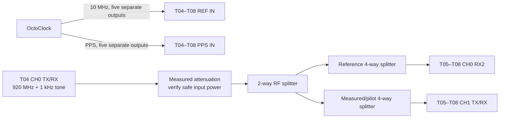
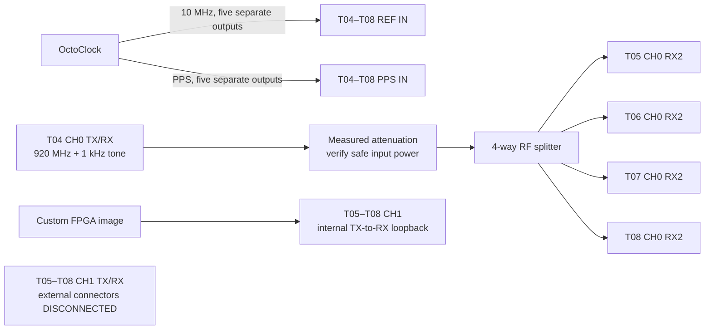

# Experiment 52 — stability and recalibration triggers (T05–T08)

This experiment implements the manuscript's temporal-stability study. It tracks a phase coefficient without changing configuration, then runs separate intervention trials for retuning, gain/port changes, device reopen, stream restart, cold start, and reference interruption. Its output supports a periodic drift threshold and an event-triggered recalibration policy.

Run long-term pilot/reference and loopback/reference measurements as **separate connection passes**. This avoids switching or transmitting into T04 during every interval.

## T04 RF source

Use T04 CH0 `TX/RX`, with its installed/default FPGA image, as the continuous RF source. It transmits a 1 kHz complex tone at a 920 MHz center frequency, producing **920.001 MHz** RF. Keep T04 open, tuned, and reference-locked throughout each uninterrupted stability pass; reopening or retuning it would invalidate the drift measurement.

After installing and measuring the complete distribution path, enter its output attenuation in `rf_source_output_attenuation_db`. Start the source on T04, for example:

```bash
python3 experiments/t05_t08_common/run_t04_source.py \
  --config experiments/52_t05_t08_stability_events/config.yml \
  --tx-gain-db 0
```

The 0 dB value is only a conservative initial bench setting. Verify the level at every receiver connector and choose the gain and attenuation from the power budget. The launcher refuses a hardware run while the attenuation remains unset.

## Connection pass A — pilot/reference stability (`external_pair`)

| From | To |
|---|---|
| OctoClock 10 MHz outputs | T04–T08 `REF IN` |
| OctoClock PPS outputs | T04–T08 `PPS IN` |
| T04 CH0 `TX/RX` through measured attenuation and a reference 4-way splitter | CH0 `RX2` on T05–T08 |
| A second branch of the same T04 output through another 4-way splitter | CH1 `TX/RX` on T05–T08 |



The two splitter inputs come from T04 through a 2-way splitter. Label every cable and leave it fixed for the run.

This pass uses the installed/default FPGA image. The custom image is selected only for `internal_loopback`.

## Connection pass B — loopback/reference stability (`internal_loopback`)

| From | To |
|---|---|
| OctoClock 10 MHz and PPS | T04–T08 reference inputs |
| T04 CH0 `TX/RX` at 920.001 MHz through measured attenuation and a 4-way splitter | CH0 `RX2` on T05–T08 |
| CH1 `TX/RX` | Disconnected from external equipment; selected by the custom FPGA loopback |



Verify loopback operation and leakage at low gain before a long unattended run.

## Steady-state run

The default is 1,440 measurements at one-minute intervals. Start one process per node:

```bash
python3 experiments/52_t05_t08_stability_events/run_node.py \
  --tile T05 --mode external_pair --event fixed_repeat
```

For a quick plan or bench check:

```bash
python3 experiments/52_t05_t08_stability_events/run_node.py \
  --tile T05 --measurements 5 --interval 0 --dry-run
```

## Intervention runs

Use a fresh output file for each event. The script records measurements before and after the intervention in one lock interval wherever the event permits it:

```bash
python3 experiments/52_t05_t08_stability_events/run_node.py \
  --tile T05 --mode internal_loopback --event lo_retune \
  --measurements 30 --event-at 15 --interval 10
```

Available events are `stream_restart`, `device_reopen`, `lo_retune`, `rx_gain_change`, `tx_gain_change`, `rx_port_change`, `cold_start`, and `reference_interruption`. The last two require `--allow-manual-event` and an operator. The script rejects `tx_gain_change` in `external_pair` mode; use the loopback pass for a TX-path result.

An RX overflow, timeout, late first timestamp, TX error, or missing lock is stored as a failed synchronization attempt and excluded from the phase series.

## Analyze and choose a policy

```bash
python3 experiments/52_t05_t08_stability_events/analyze.py \
  experiments/52_t05_t08_stability_events/runs/*.jsonl \
  --threshold-deg 5 --output-prefix stability
```

`stability_timeseries.csv` contains wrapped phase error versus elapsed time. `stability_summary.csv` reports circular spread, linearized drift, event jump, and the first threshold crossing. Use the shortest credible threshold-crossing time—after checking for temperature trends and failed runs—as the initial periodic recalibration interval. Independently trigger recalibration after every event that produces a repeatable phase jump.
