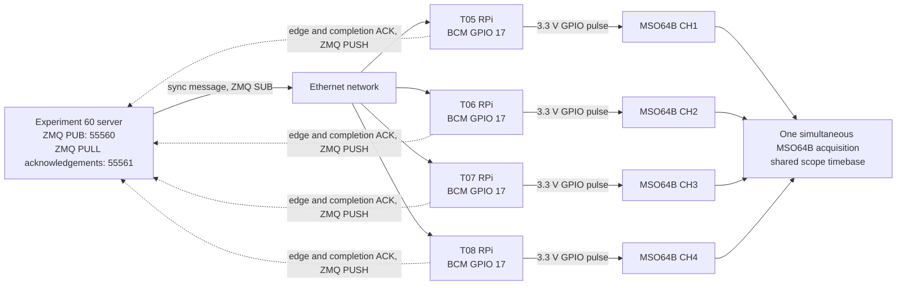

# Experiment 60 — ZMQ GPIO-arrival timing (T05–T08)

## Purpose

Measure how far apart the four Raspberry Pis react when the Experiment 60 server
publishes one common ZMQ synchronization message.  On receipt, each client drives
one GPIO output high for one second.  A single MSO64B acquisition records all four
rising edges, which makes the scope timebase the only valid authority for the
inter-tile delay measurement.

The measured quantity is end-to-end **ZMQ reception to observable GPIO rise**.  It
therefore includes ZMQ delivery, client scheduling and JSON handling, and the RPi
GPIO actuation path.  The scope deliberately cannot—and does not claim to—separate
those contributions.

This is a host/network-control experiment.  It does **not** use a B210, PPS,
10 MHz, an RF signal, or T04.  In particular, the clients' `monotonic_ns` values
are recorded only as per-host diagnostics: clocks on separate RPis are not assumed
to share an epoch and must not be subtracted from one another.

The experiment answers:

- What are the mean, spread, and 95th-percentile relative GPIO-rise offsets for
  T06–T08 relative to T05 after one ZMQ publication?
- What is the per-trial four-tile peak-to-peak GPIO skew, including its tail?
- Do all four clients receive every message and complete the intended pulse?

It does not establish B210 device-time synchronization or a bound on timed UHD
commands.  ZMQ PUB distributes a common software event; it is not a deterministic
hardware trigger or a synchronization barrier.

## Connection graph



The four scope channels must be acquired in the *same* MSO64B record (or the same
segmented acquisition).  Four separate acquisitions cannot measure the relative
message-arrival delay.

## Hardware connections

`GPIO 17` means the BCM GPIO number, not physical header pin 17.  BCM 17 is
physical pin 11 on the standard 40-pin Raspberry Pi header.  Check that this pin
is unused on each tile before running; change `gpio_bcm_pin` in `config.yml` if it
is not available.

| Tile | GPIO connection | MSO64B connection |
|---|---|---|
| T05 | BCM GPIO 17 (physical pin 11) | CH1 probe tip to GPIO; probe ground to T05 ground |
| T06 | BCM GPIO 17 (physical pin 11) | CH2 probe tip to GPIO; probe ground to T06 ground |
| T07 | BCM GPIO 17 (physical pin 11) | CH3 probe tip to GPIO; probe ground to T07 ground |
| T08 | BCM GPIO 17 (physical pin 11) | CH4 probe tip to GPIO; probe ground to T08 ground |

Use 10x, high-impedance probes and configure every MSO64B input for 1 MOhm.  Do
**not** use a 50 Ohm scope termination on a Raspberry Pi GPIO.  Connect only the
probe tips and ground leads described above—never drive a GPIO from the scope.
Confirm that the RPi grounds and the scope grounding arrangement are safe before
attaching all four ground clips.

There is no RF wiring in Experiment 60.  Keep the usual T04-to-T05–T08 RF setup
disconnected from this measurement unless it is needed by a separate, inactive
experiment.

## Scope setup

1. Use one MSO64B timebase for CH1–CH4, with all channels set for a 3.3 V logic
   signal and a 1.65 V rising-edge threshold.  The matching defaults are in
   `config.yml`.
2. Trigger on CH1 rising.  Start with enough pre- and post-trigger span to capture
   the expected network jitter (for example, 50 ms before and after the first
   edge).  Use a sample rate that resolves the desired edge timing.
3. For many repetitions, use a segmented acquisition if available, but every
   segment must contain CH1–CH4 under the same timebase.  The configured 1 s high
   pulse, server acknowledgement wait, and 0.5 s inter-trial delay keep events
   distinct.  The record length need only cover the rising edges; it need not
   contain the complete one-second high period.
4. Export a CSV with one time column and the four simultaneous voltage columns.
   Normalize the CSV header to exactly:

   ```text
   time_s,CH1,CH2,CH3,CH4
   ```

   `time_s` must be strictly increasing inside each export.  The analyzer accepts
   several such exports and treats their complete rising-edge sets as consecutive
   trials.

## Software setup

Install the listed Python packages on the server and all four RPis:

```bash
python3 -m pip install -r experiments/60_t05_t08_zmq_gpio_arrival/requirements.txt
```

`gpiozero` must have access to the local Raspberry Pi GPIO hardware.  It is
intentionally imported only on a real client run, so connection plans can be
checked from another machine using `--dry-run`.

## Run procedure

1. On the server, start the coordinator.  It binds the PUB endpoint on port 55560
   and the acknowledgement endpoint on port 55561, then waits for all four tiles:

   ```bash
   python3 experiments/60_t05_t08_zmq_gpio_arrival/server/zmq_sync_server.py
   ```

2. Arm the MSO64B before all clients report ready.  The server deliberately waits
   `ready_warmup_s` (3 s by default) after the last readiness acknowledgement, so
   the ZMQ subscriptions have time to settle and the scope can be armed.
3. On T05–T08, respectively, start one client, replacing `<server-ip>` with the
   reachable server address:

   ```bash
   python3 experiments/60_t05_t08_zmq_gpio_arrival/client/zmq_gpio_client.py --tile T05 --server <server-ip>
   python3 experiments/60_t05_t08_zmq_gpio_arrival/client/zmq_gpio_client.py --tile T06 --server <server-ip>
   python3 experiments/60_t05_t08_zmq_gpio_arrival/client/zmq_gpio_client.py --tile T07 --server <server-ip>
   python3 experiments/60_t05_t08_zmq_gpio_arrival/client/zmq_gpio_client.py --tile T08 --server <server-ip>
   ```

4. The server publishes sequence 0 only after it receives all four `ready`
   messages.  It then waits for every rising-edge acknowledgement and every
   one-second-pulse completion before sending the next message.  A missing client,
   a missing receipt, or an unexpected sequence stops the run and is recorded in
   the server JSONL log.
5. Save the simultaneous scope record(s), retain the server and client JSONL logs,
   and disconnect the probes only after all GPIO pulses are low.

For a connection/configuration check without binding sockets or touching GPIO,
run the following on the relevant machines:

```bash
python3 experiments/60_t05_t08_zmq_gpio_arrival/server/zmq_sync_server.py --dry-run
python3 experiments/60_t05_t08_zmq_gpio_arrival/client/zmq_gpio_client.py --tile T05 --server <server-ip> --dry-run
```

To change the trial count, pass the same `--repetitions N` to the server and to
each client, or change `repetitions` once in `config.yml`.

## Scope analysis and measured values

Run the analyzer where NumPy and Matplotlib are available.  Give it only CSV
exports in the normalized four-channel form above:

```bash
python3 experiments/60_t05_t08_zmq_gpio_arrival/processing/analyze_scope.py \
  scope_csv/run_001.csv scope_csv/run_002.csv \
  --output-prefix results/exp60_zmq_gpio
```

It linearly interpolates each channel's 1.65 V rising crossing and writes:

- `*_edges.csv` — every complete four-channel edge set.  `T06_minus_T05_us`,
  `T07_minus_T05_us`, and `T08_minus_T05_us` are the signed scope-measured
  offsets.  `peak_to_peak_skew_us` is the latest edge minus earliest edge across
  T05–T08 for that trial.
- `*_summary.csv` — count, mean, sample standard deviation, median, 95th
  percentile of absolute offset/skew, and extrema for each offset and for
  four-tile peak-to-peak skew.
- `*_edge_count_mismatches.csv`, when a record has unequal edge counts.  This is
  evidence of a missing/non-detected pulse and is not silently paired.
- `*_edge_offsets.png` and `*_four_tile_skew.png` — Matplotlib figures of the
  per-trial offsets and peak-to-peak skew.

The scope-derived CSV values are the experiment results.  Do not calculate the
cross-RPi timing delta by subtracting `client_receive_monotonic_ns` or
`gpio_high_monotonic_ns`; their local clock epochs are independent.  Those fields,
along with server publication time and acknowledgement logs, only help diagnose
message flow, pulse duration, and failures within an individual host.
