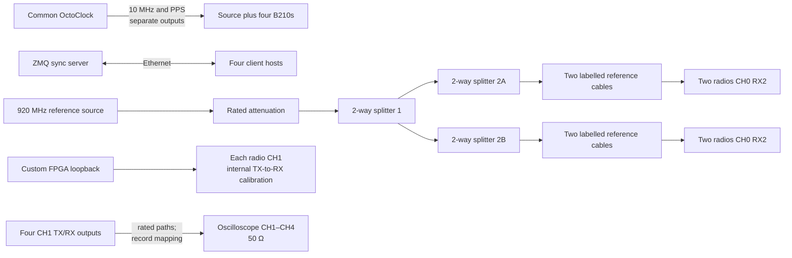

# XXX_mulit_usrp_sync_only_lb_clo — archived template

- clo = cable length offset

- Four USRPs are synchronized using the reference signal applied to the RX port of channel 0.
- The RX/TX port of channel 1 is connected to the oscilloscope.
- A total of 100 iterations are performed.
- During each synchronization cycle, the oscilloscope measures the phase relationship of channels 2, 3, and 4 with respect to channel 1.

## Inferred connections

This is an incomplete template derived from the related Experiment 30–33 code. Confirm the source tile, cable-phase file, client count, and scope mapping before reuse.

### Results [raw & abs(raw)]

<table>
  <tr>
    <td></td>
    <td></td>
  </tr>
</table>

### Results [between outputs same 2-way splitter & between outputs different 2-way splitters]

<table>
  <tr>
    <td></td>
    <td></td>
  </tr>
</table>
