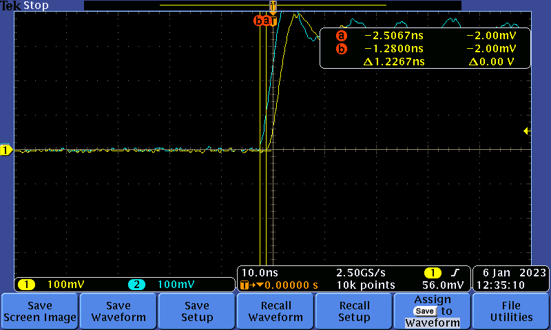

# Testing simultanious GPIO toggle

In this test, we toggle (low to high) the GPIO of the B210 based on time commands.
We measured the time diff between the rising edge with the DPO3012 oscilloscope (2.5Gs/s).
The results is shown below:

