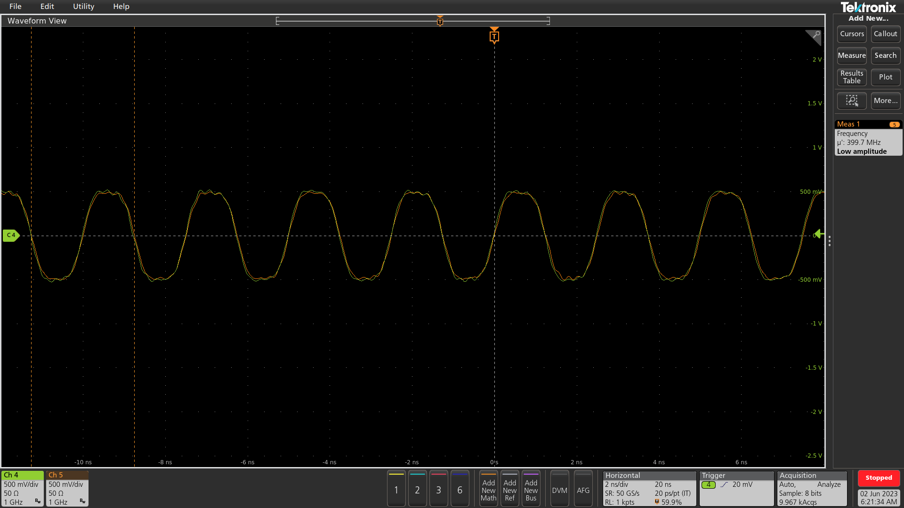
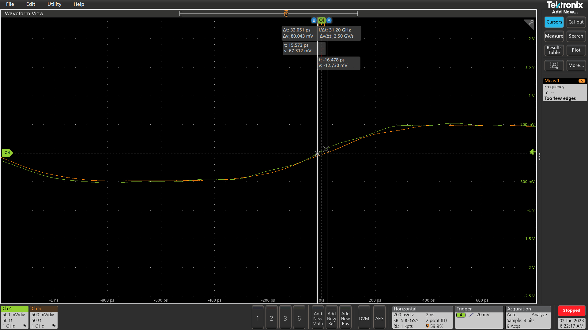
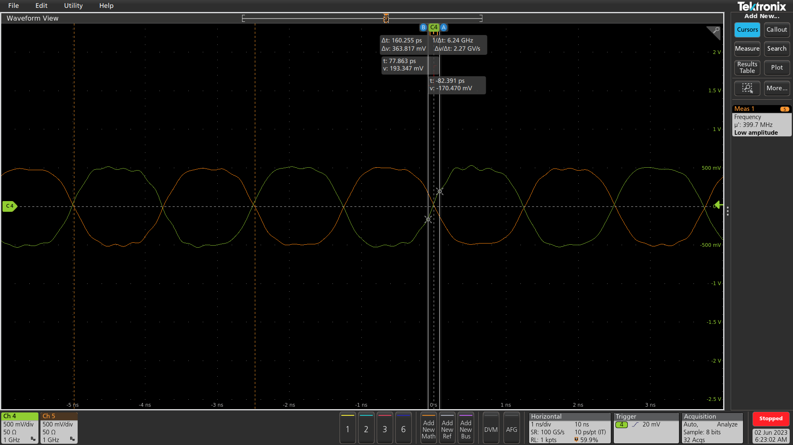
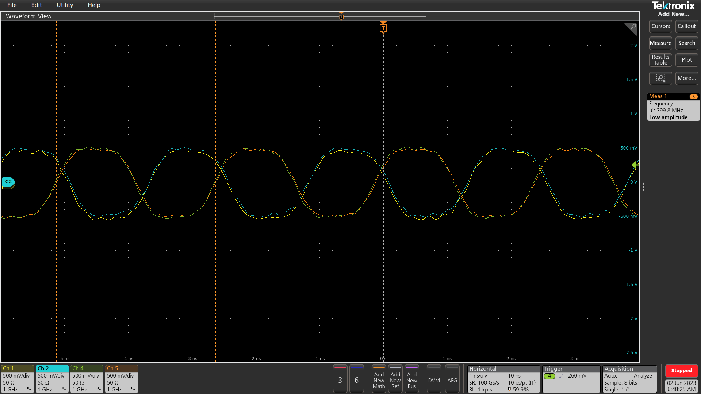

# Reciprocity calibration RX and TX PLL of USRP B210

**STEPS TO FOLLOW**

https://github.com/techtile-by-dramco/NI-B210-Sync/assets/8626571/951605d9-fbe6-4f4d-9bd9-e3b61ec03a3c

**Problem:** It is not possible to **transmit phase coherent signals** with different individual USRPs.<br>
**Reason:** PLLs lock is not constant in time (Even if NI Clock Distribution Devices CDA-2990, the problem can not be solved.) The NI Clock Distribution Devices only prevents occurring frequency offsets, frequency drifts and phase drifts. The _**phase offset**_ cannot be controlled without adjustments of the HW or by adding additional feedback cables. This study focusses on this last synchronisation topic.

Purpose is to generate two sine waves that are in phase when pilot signal was received on both input channels.

*** Step 1 ***
- [x] Phase relation between two transmit channels of same USRP (1.1.1.)
- [x] Check the adaptability of the phase relation between the two channels on same USRP (1.1.2.)
- [x] Phase relation between two transmit channels of two USRPs (1.2.1.)

*** Step 2 ***
- [x] Measure phase difference of internal RF-PLLs (2.1.)
- [x] Calibrate phase difference of internal RF-PLLs (i.e., applying `-phase offset`) (2.2.)
- [ ] Measure long term stabability of the calibrated phase (2.3.)
- [x] **`EXTENSION`** Use an antenna instead of a feedback cable to do the calibration (2.4.)

*** Step 3 ***
- [ ] Use external reference signal to broadcast coherently with two individual USRPs (3.1.)
- [ ] Check phase coherency between RX and RX/TX on same USRP, does switching result in re-locking/re-tuning?


<details>
<summary>
  
  # STEP 1. Proof of the "phase coherency" problem
  
  </summary>


${\color{lightblue} \text{This first step serves rather as confirmation showing the current situation and shortcomings of the B210 USRP.}}$

## 1.1. START with one USRP

### 1.1.1. Phase relation between two transmit channels of same USRP
- Generating two signals on the same USRP (e.g., 400 MHz signals) without coded phase shifts.
- MEASURE outputs TX-1 (USRP-1) and TX-2 (USRP-1) connected to a scope and visualize phase relation.

File: [test_111.cpp](test_111.cpp)

Command used: ` make -j4 && ./init_usrp --ignore-server --channels="0,1" --rate=250e3 --gain=0.8`





DOCS


### 1.1.2. Check the adaptability of the phase relation between the two channels on same USRP
- Similarly, generate two signals know with relative phase shift (e.g. 90°).
- MEASURE outputs TX-1 (USRP-1) and TX-2 (USRP-1) connected to a scope and visualize phase relation.
- Does the result correspond to the configured phase relationship?

File: [test_112.cpp](test_112.cpp)

Command used: ` make -j4 && ./init_usrp --ignore-server --channels="0,1" --rate=250e3 --gain=0.8`



[x] completed task

## 1.2. Measurements with two USRPs

${\color{red} \text{Visualize the phase coherency problem!}}$

### 1.2.1 Phase relation between two transmit channels of two USRPs
- Generating a sine wave with both USRPs (e.g., 400 MHz signals) without coded phase shifts and equal frequency.
- MEASURE outputs TX-1 (USRP-1) and TX-1 (USRP-2) connected to a scope and visualize phase relation.

File: [test_111.cpp](test_111.cpp)

Command used: ` make -j4 && ./init_usrp --ignore-server --channels="0,1" --rate=250e3 --gain=0.8`

On two USRPs:



[x] completed task

**Repeat process several times** --> Phase difference will be different each time!
After this step the problem is clearly demonstrated.
</details>

<details>
<summary>
  
# STEP 2. Compensate phase differences RF-PLLs
  
  </summary>

The purpose is to measure the accumulated phase yielded from the RX RF-PLL and the TX RF-PLL (and cable). 

- Start to lock the USRP RX and TX RF-PLL on the same frequency $f$.
- This measurement requires a physical 50 ohm SMA cable connection between RX-1 and TX-1 of the USRP.
- The measured phase difference will contain the sum of several components.

Signal representation of at the input and output of the USRP channels <br>
* Transmit signal $tx_1(t) = \exp(j2\pi ft) \cdot \exp(j \phi_{pll,tx}) \cdot \exp(\phi_{L,tx})$
* Receive signal $rx_1(t) = \exp(j2\pi ft) \cdot \exp(\phi_{pll,rx}) \cdot \exp(\phi_{L,rx})$ <br>
With: <br>
  - $tx_1(t)$ and $rx_1(t)$ the signals transmitted or received at the SMA ports of the USRP.
  - $\phi_{tx,configured}$ and $\phi_{rx,offset}$ is the configured and recieved phases respectively.
  - $\phi_{L,rx}$ and $\phi_{L,rx}$ is the RF path between SMA connector port and RF transceiver IC.
  - $\phi_{pll,tx}$ and $\phi_{pll,rx}$ the initial absolute PLL phase realtive to some reference.

<!-- Multiplying transmit signal $tx_1(t)$ with receive signal $rx_1(t)$ gives the phase shift introduced by the SMA cable. -->
The received signal is the sum of the transmitted signal and the phase shift occured in the SMA cable.
$$rx_1(t) = tx_1(t) \cdot \exp(\phi_{SMA,cable})$$

$$\exp(j2\pi ft) \cdot \exp(\phi_{tx,configured}) \cdot \exp(\phi_{pll,tx}) \cdot \exp(\phi_{L,tx}) = \exp(j2\pi ft) \cdot \exp(\phi_{rx,offset}) \cdot \exp(\phi_{pll,rx}) \cdot \exp(\phi_{L,rx}) \cdot \exp(\phi_{SMA,cable})$$

Assuming that $\exp(\phi_{L,rx}) \approx \exp(\phi_{L,tx})$ and knowing $\exp(\phi_{SMA,cable})$ (due to the lenght of the cable), the phase difference between the tx and rx path can be determined.

The following formule contains all phase shift contributions when measuring the received phase.
$${\color{green} \phi_{rx,offset} = \phi_{tx,configured} + \Delta\phi_{pll} + \phi_{L,tx} - \phi_{L,rx} + \phi_{SMA,cable}}$$

  - The phase difference between both PLLs is represented by $\Delta\phi_{pll} = \phi_{pll,tx} - \phi_{pll,rx}$.
  - $\phi_{tx,configured}$ can be configured to zero during calibration.
  - $\phi_{L,tx}$, $\phi_{L,rx}$ is expected to be constant for all URSPs
  - If same cables length from same manufacturer are selected, $\phi_{SMA,cable}$ is expected to be constant for all URSPs

## 2.1 Measure accumulated phase of the internal TX and RX RF-PLLs

Measuring $\phi_{rx,offset}$ can be seen as the calibration procedure.
After this step, the PLL may not lock again, since the phase offset will change.

Command used: `make -j4 && ./init_usrp --ref="external" --tx-freq=400E6 --rx-freq=400E6 --tx-rate=250E3 --rx-rate=250E3 --tx-gain=1`

Setup: TX/RX A -- 20dB att. -- 16-port splitter -- RX2 (all on the same USRP)

Description: 16-port splitter was in between to visualize the transmitted signal on the scope. 16-port as no other was available.

USRP program: [test_21.cpp](test_21.cpp)

The produced out.dat file is then processed by [test_211.ipynb](test_211.ipynb).

## 2.2 Compensate for the RX-TX phase

In this step the accumulated phase is measured through a loopback (as in 2.1.1). 
This phase is computed by pushing the IQ data through a ZMQ subscriber [test_22.py](test_22.py).
Hereafter, the baseband is phase shifted by the measured phase.

Output example:
```
Listening for IQ samples
. . . . . . . . . . . . . . . . . . . . . . . . . . . . . . . . . . . . . . . . . . . . . . . . . . . . . . . . . . . . . . . . . . . . . . . . . . . . . . . . . . . . . . . . . . . . . . . . . . . . . . . . . . . . . . . . . . . . . . . . . . . . . . . . . . . . . . . . . . . . . . . . . . . . . . . . . . . . . . . . . . . . . . . . . . . . . . . . . . . . . . . . . . . . . . . . . . . . . . . . . . . . . . . . . . . . . . . . . . . . . . . . . . . . . . . . . . . . . . . . . . . . . . . . . . . . . . . . . . . . . . . . . . . . . . . . . . . . . . . . . . . . . . . . . . . . . . . . . . . . . . . . . . . . . . . . . . . . . . . . . . . . . . . . . . . . .
 . . . . . . . . . . . . . . . . . . . . . . . . . . . . . . . . . . . . . . . . . . . . . . . . . . . . . . . . . . . . . . . . . . . . . . . . . . . . . . . . . . . . . . . . . . . . . . . . . . . . . . . . . . . . . . . . . . . . . . . . . . . . . . . . . . . . .
 . . . . . . . . . . . . . . . . . . . . . . . . . . . . . . . . . . . . . . . . . . . . . . . . . . . . . . . . . . . . . . . . . . . . . . . . . . . . . . . . . . . . . . . . . . . . . . . . . . . . . . . . . . . . . . . . . . . . . . . . . . . . . . . . . . . . .
 . . . . . . . . . . . . . . . . . . . . . . . . . . . . . . . . . . . . . . . . . . . . . . . . . . . . . . . . . . . . . . . . . . . . . . . . . . . . . . . . . . . . . . . . . . . . . . . . . . . . . . . . . . . . . . . . . . . . . . . . . . . . . . . . . . . . . . . . . . . . . . . . . . . . . . . . . . . . . . . . . . . . . . . . . . . . . . . . . . . . . . . . . . . . . . . . . . . . . . . . . . . . . . . . . . . . . . . . . . . . . . . . . . . . . . . . . . . . . . . . . . . . . . . . . . . . . . . . . . . . . . . . . .
 . . . . . . . . . . . . . . . . . . . . . . . . . . . . . . . . . . . . . . . . . . . . . . . . . . . . . . . . . . . . . . . . . . . . . . . . . . . . . . . . . . . . . . . . . . . . . . . . . . . . . . . . . . . . . . . . . . . . . . . . . . . . . . . . . . . . . . . . . . . . . . . . . . . . . . . . . . . . . . . . . . . . . . . . . . . . . . . . . . . . . . . . . . . . . . . . . . . . . . . . . . . . . . . . . . . . . . . . . . . . . . . . . . . . . . . . . . . . . . . . . . . . . . . . . . . . . . . . . . . . . . . . . . . . . . . . . . . . . . . . . . . . . . . . . . . . . . . . . . . . . . . . . . . . . . . . . . . . . . . . . . . . . . . . . . . . . . . . . . . . . . . . . . . . . . . . . . . . . . . . . Done RX'en
10.00s recorded
std: 0.26°
mean: -135.15°
Listening for incoming messages.
returning -135.15074700119916° in radians
Listening for IQ samples
. . . . . . . . . . . . . . . . . . . . . . . . . . . . . . . . . . . . . . . . . . . . . . . . . . . . . . . . . . . . . . . . . . .
 . . . . . . . . . . . . . . . . . . . . . . . . . . . . . . . . . . . . . . . . . . . . . . . . . . . . . . . . . . . . . . . . . . . . . . . . . . . . . . . . . . . . . . . . . . . . . . . . . . . . . . . . . . . . . . . . . . . . . . . . . . . . . . . . . . . . . . . . . . . . . . . . . . . . . . . . . . . . . . . . . . . . . . . . . . . . . . . . . . . . . . . . . . . . . . . . . . . . . . . . . . . . . . . . . . . . . . . . . . . . . . . . . . . . . . . . . . . . . . . . . . . . . . . . . . . . . . . . . . . . . . . . . .
 . . . . . . . . . . . . . . . . . . . . . . . . . . . . . . . . . . . . . . . . . . . . . . . . . . . . . . . . . . . . . . . . . . . . . . . . . . . . . . . . . . . . . . . . . . . . . . . . . . . . . . . . . . . . . . . . . . . . . . . . . . . . . . . . . . . . .
 . . . . . . . . . . . . . . . . . . . . . . . . . . . . . . . . . . . . . . . . . . . . . . . . . . . . . . . . . . . . . . . . . . . . . . . . . . . . . . . . . . . . . . . . . . . . . . . . . . . . . . . . . . . . . . . . . . . . . . . . . . . . . . . . . . . . . . . . . . . . . . . . . . . . . . . . . . . . . . . . . . . . . . . . . . . . . . . . . . . . . . . . . . . . . . . . . . . . . . . . . . . . . . . . . . . . . . . . . . . . . . . . . . . . . . . . . . . . . . . . . . . . . . . . . . . . . . . . . . . . . . . . . .
 . . . . . . . . . . . . . . . . . . . . . . . . . . . . . . . . . . . . . . . . . . . . . . . . . . . . . . . . . . . . . . . . . . . . . . . . . . . . . . . . . . . . . . . . . . . . . . . . . . . . . . . . . . . . . . . . . . . . . . . . . . . . . . . . . . . . .
 . . . . . . . . . . . . . . . . . . . . . . . . . . . . . . . . . . . . . . . . . . . . . . . . . . . . . . . . . . . . . . . . . . . . . . . . . . . . . . . . . . . . . . . . . . . . . . . . . . . . . . . . . . . . . . . . . . . . . . . . . . . . . . . . . . . . .
 . . . . . . . . . . . . . . . . . . . . . . . . . . . . . . . . . . . . . . . . . . . . . . . . . . . . . . . . . . . . . . . . . . . . . . . . . . . . . . . . . . . . . . . . . . . . . . . . . . . . . . . . . . . . . . . . . . . . . . . . . . . . . . . . . . . . .
 . . . . . . . . . . . . . . . . . . . . . . . . . . . . . . . . . . . . . . . . . . . . . . . . . . . . . . . . . . . . . . . . . . . . . . . . . . . . . . . . . . . . . . . . . . . . . . . Done RX'en
10.00s recorded
std: 0.01°
mean: -0.00°
Listening for incoming messages.
returning -0.0004134944703732054° in radians
```


Command used: ` make -j4 && ./init_usrp --ref="external" --tx-freq=400E6 --rx-freq=400E6 --tx-rate=250E3 --rx-rate=250E3 --tx-gain=0.8 --rx-gain=50 --tx-channels="0,1" --rx-channels="0,1"`

Setup: TX/RX A -- 20dB att. -- 16-port splitter -- RX2 (all on the same USRP)

Description: 16-port splitter was in between to visualize the transmitted signal on the scope. 16-port as no other was available.

USRP program: [test_22.cpp](test_22.cpp)


## 2.3. Measure synchronised phase stabability

PHOTO
DOCS

- [x] incomplete task
- [ ] completed task


## 2.4. Use antennas instead of cables to do calibration

- Start with two antennas that has a high return loss for the desired frequency (917 MHz).
- Mount the antennas on Techtile-tiles and redo similar measurements executed in 2.2. and 2.3.
- Can we calibrated the phase offset of RFPLLs over the air?

PHOTO
DOCS

- [x] incomplete task
- [ ] completed task
  
</details>

<details>
<summary>
  
# STEP 3. Phase differences between multiple USRPs
  Compensate for phase differences between the RF-PLLs of multiple USRPs and measure incoming pilot signals.
  </summary>
If previous step 2 was successful, pilot based tests are the logical next step.
A pilot signal could be generated with another USRP or the RF generator _SMC100A_ (available in our lab).

For this step, it is required to have time synchronisation. Both time drift and time offset can be controllered with the PPS input.
Every URSP is connected to an PPS output of NI Clock Distribution Devices CDA-2990.
- It is mandatory to measure the incoming signal in_1(t), in_2(t), ..., in_n(t) on the $N$ USRP simultaneously at time $t_0$. 
- Consequently, it is mandatory to start transmitting the signals simultaneously at time $t_1$.

## 3.1. Use external reference signal to broadcast coherently with two individual USRPs

The purpose is to generate phase coherent sine waves with multiple USRPs.

Initially, it should be validated that all USRPs could deliver a perfectly synchronised sine wave.
A first test excists of a perfectely phase coherent incoming pilot signal on all USRPs.
On t1 all USRP output signals should generate phase coherent output signals.
To test this, an RF splitter can be selected to ensure the incoming "pilot" signals are phase coherent.

## 3.1.1. Measure incoming phase on t0

Measuring $\phi_{rx,pilot,n,t0}$

PHOTO
DOCS

- [x] incomplete task
- [ ] completed task

## 3.1.2. Generate outcoming signal on t1

$\phi_{tx,configured,n,t1} = \phi_{rx,offset,n} + \phi_{rx,pilot,n,t0}$

With: <br>
  - $\phi_{rx,offset,n}$ the offset measured in step 2 for the $n^th$ USRP.
  - $\phi_{rx,pilot,n,t0}$ the measured phase at t0 (during pilot transmission).

PHOTO
DOCS

- [x] incomplete task
- [ ] completed task

</details>

## Loopback only works on frequencies (x times 10MHz) 
Possible sources to solve
- [USRP TUNING](http://www.radio-science.net/2017/12/adventures-in-usrp-tuning.html)


